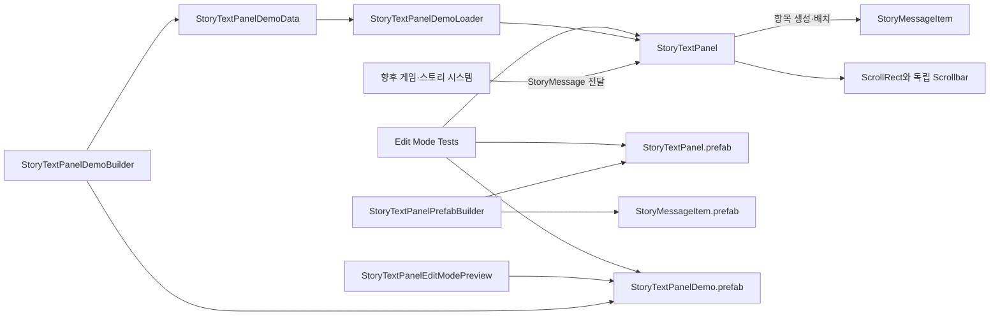

# TxT-RPG 프로젝트 문서

이 디렉터리는 프로젝트의 구조, 클래스와 Unity 오브젝트의 책임, 자산 관계, 개발 절차를 설명합니다. 새로운 기능을 분석하거나 수정하기 전에 이 문서에서 관련 영역을 확인하십시오.

## 문서 목록

| 문서 | 설명 |
| --- | --- |
| [프로젝트 구조](architecture/project-structure.md) | 디렉터리, 어셈블리, 런타임·Editor·테스트 경계를 설명합니다. |
| [StoryTextPanel 설계](architecture/story-text-panel.md) | 클래스, 프리팹, 데이터 흐름, 스크롤과 투명도 동작을 설명합니다. |
| [CharacterDisplayPanel 설계](architecture/character-display-panel.md) | 캐릭터 표시 요청, 2D View, 외형 정의, 전환과 향후 3D 확장 경계를 설명합니다. |
| [EnemyDisplayPanel 설계](architecture/enemy-display-panel.md) | 다중 적의 인스턴스 식별, 2D View 풀, 포메이션과 향후 3D Backend 경계를 설명합니다. |
| [ActionGridPanel 설계](architecture/action-grid-panel.md) | 아이템·스킬 공통 그리드, 반응형 배치, 선택, 컨텍스트 메뉴와 명령 실행 경계를 설명합니다. |
| [FlexibleLayoutPanel 설계](architecture/flexible-layout-panel.md) | UI 영역의 재귀 분할, 가중치·고정 크기, 최소·최대 크기와 반응형 축 정책을 설명합니다. |
| [Addressables 에셋 관리](architecture/asset-management.md) | Provider, Lease, 화면 Scope, 안정적인 ID와 수명 기반 그룹 정책을 설명합니다. |
| [Panel Startup 설계](architecture/panel-startup.md) | 초기 데이터와 자산 준비, 레이아웃 확정, 등장 연출과 입력 활성화 순서를 설명합니다. |
| [Scene Transition 설계](architecture/scene-transition.md) | 영속 루트, Scene 로딩, 전체 화면 효과, 준비 신호와 실패 복구 흐름을 설명합니다. |
| [개발 및 검증 절차](development/workflows.md) | 프리팹 재생성, 데모 미리보기, 테스트와 변경 시 확인 사항을 설명합니다. |

## 현재 구현 범위

현재 프로젝트에서 직접 구현한 제품 UI 기능은 메시지 표시 영역인 `StoryTextPanel`, 캐릭터 표시 영역인 `CharacterDisplayPanel`, 다중 적 표시 영역인 `EnemyDisplayPanel`, 아이템·스킬 선택 영역인 `ActionGridPanel`과 이 영역들을 재귀적으로 조합하는 `FlexibleLayoutPanel`입니다. 기본 Unity 샘플 씬과 튜토리얼 자산은 제품 아키텍처에 포함하지 않습니다.

`StoryTextPanel` 기능은 다음 영역으로 분리되어 있습니다.

## 문서 사용 원칙

- 클래스나 프리팹의 책임을 변경할 때 관련 아키텍처 문서를 함께 수정합니다.
- 새 어셈블리, 주요 디렉터리, 실행 진입점 또는 데이터 흐름을 추가하면 프로젝트 구조 문서를 수정합니다.
- Editor 메뉴나 생성 절차가 바뀌면 개발 및 검증 절차 문서를 수정합니다.
- 문서에 기재된 경로, 클래스명, 메뉴명은 실제 프로젝트와 일치해야 합니다.
- 구현되지 않은 계획은 현재 구조처럼 서술하지 않고 별도의 후속 작업으로 구분합니다.
