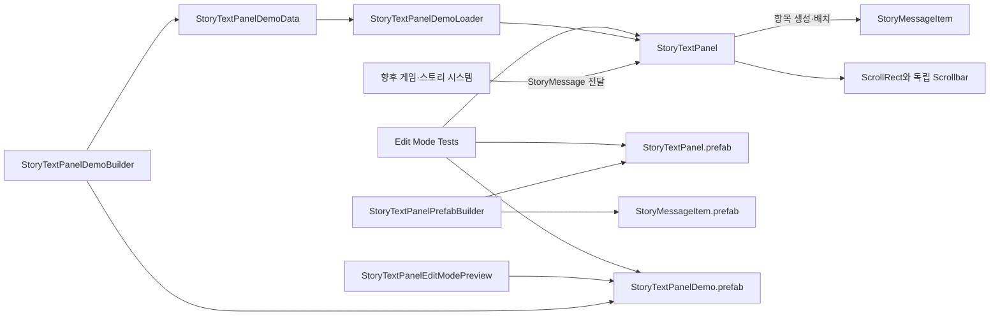

# TxT-RPG 프로젝트 문서

이 디렉터리는 프로젝트의 구조, 클래스와 Unity 오브젝트의 책임, 자산 관계, 개발 절차를 설명합니다. 새로운 기능을 분석하거나 수정하기 전에 이 문서에서 관련 영역을 확인하십시오.

## 문서 목록

| 문서 | 설명 |
| --- | --- |
| [프로젝트 구조](architecture/project-structure.md) | 디렉터리, 어셈블리, 런타임·Editor·테스트 경계를 설명합니다. |
| [StoryTextPanel 설계](architecture/story-text-panel.md) | 클래스, 프리팹, 데이터 흐름, 스크롤과 투명도 동작을 설명합니다. |
| [CharacterDisplayPanel 설계](architecture/character-display-panel.md) | 캐릭터 표시 요청, 2D View, 외형 정의, 전환과 향후 3D 확장 경계를 설명합니다. |
| [EnemyDisplayPanel 설계](architecture/enemy-display-panel.md) | 다중 적의 인스턴스 식별, 2D View 풀, 포메이션과 향후 3D Backend 경계를 설명합니다. |
| [ActionGridPanel 설계](architecture/action-grid-panel.md) | 아이템·스킬 공통 그리드, 반응형 배치, 선택, 컨텍스트 메뉴와 명령 실행 경계를 설명합니다. |
| [FlexibleLayoutPanel 설계](architecture/flexible-layout-panel.md) | UI 영역의 재귀 분할, 가중치·고정 크기, 최소·최대 크기와 반응형 축 정책을 설명합니다. |
| [Addressables 에셋 관리](architecture/asset-management.md) | Provider, Lease, 화면 Scope, 안정적인 ID와 수명 기반 그룹 정책을 설명합니다. |
| [Panel Startup 설계](architecture/panel-startup.md) | 초기 데이터와 자산 준비, 레이아웃 확정, 등장 연출과 입력 활성화 순서를 설명합니다. |
| [Scene Transition 설계](architecture/scene-transition.md) | AppScene, Additive 콘텐츠 교체, 초기화 계약, 전체 화면 효과와 실패 복구 흐름을 설명합니다. |
| [캐릭터와 플레이어 Gameplay 도메인](architecture/character-domain.md) | 캐릭터 스탯·체력·피해 계산, 플레이어 소유 목록과 복수 캐릭터 저장 경계를 설명합니다. |
| [캐릭터 콘텐츠 구성](architecture/character-content.md) | Gameplay Definition과 UI Appearance를 묶는 콘텐츠 원본, 카탈로그와 제작 검증 절차를 설명합니다. |
| [PlayerSession과 새 게임 초기화](architecture/player-session.md) | 기본 캐릭터 선택, 저장 복원, AppScene 수명과 운영 캐릭터 UI 연결을 설명합니다. |
| [TMP_MainScene 기본 표시와 Preview](architecture/main-scene-default-presentation.md) | 배포용 대체 표시, 상태 구분, 운영 Scene 연결과 격리된 Preview를 설명합니다. |
| [캐릭터 상태 UI 설계](architecture/character-status-ui.md) | 선택적 상태 Element, HealthBarPanel과 외형·상태 Binder 분리를 설명합니다. |
| [개발 및 검증 절차](development/workflows.md) | 프리팹 재생성, 데모 미리보기, 테스트와 변경 시 확인 사항을 설명합니다. |
| [설정 가능한 주사위 Gameplay 도메인](architecture/dice-domain.md) | 면별 정수 구성, 허용 범위, 런타임 변경과 주입 가능한 균등 굴림 계약을 설명합니다. |
| [Main Scene 시각 개선 제안안](development/main-scene-visual-proposal.md) | 원본과 격리된 제안 Scene의 구성, 생성·실행·비교 절차와 검증 범위를 설명합니다. |
| [등록 기반 Prefab Rebuild](architecture/prefab-rebuild-registry.md) | 안전한 생성 작업의 명시적 등록, 계획 검증, 실행과 제외 정책을 설명합니다. |
| [한국어 TMP 대체 폰트](architecture/korean-font-fallback.md) | 기존 영문 폰트를 유지하는 전역 Noto Sans KR fallback, 라이선스, 적용과 검증 절차를 설명합니다. |

## 작업 지침서

| 문서 | 설명 |
| --- | --- |
| [StoryTextPanel 레이아웃 수명주기 오류 수정](instructions/story-text-layout-lifecycle-null-fix.md) | 초기화 중 참조 누락과 레이아웃 재진입을 구분하고 크기 변경 콜백의 예외를 수정·검증합니다. |
| [한국어 표시와 TMP 대체 폰트 수정](instructions/korean-text-font-fallback-fix.md) | 한국어 깨짐의 원인을 구분하고 기존 영문 폰트를 유지한 채 한글 fallback과 빌드 검증을 적용합니다. |
| [임시 주사위 보유와 메뉴 굴림](instructions/temporary-player-dice-roll-menu.md) | 세션에 D4·D6·D8을 보유하고 메뉴 버튼으로 굴린 개별 결과를 StoryTextPanel에 누적 표시합니다. |
| [설정 가능한 주사위 도메인](instructions/configurable-dice-domain.md) | 중복 정수 면, 균등 면 추첨, 런타임 구성 변경과 추후 소유·장착 연결 경계를 구현합니다. |
| [Grid 표시 크기의 비율·고정 상한](instructions/action-grid-ratio-capped-sizing.md) | Icon과 EmptySlot에 비율 계산값과 고정 최대 크기 중 작은 값을 축별로 적용합니다. |
| [Grid 빈 슬롯 표시 크기](instructions/action-grid-empty-slot-sizing.md) | EmptySlot에 독립적인 비율·고정 여백 설정을 제공하고 아이템 Icon 설정과 구분합니다. |
| [Grid Cell 반응형 아이콘 크기](instructions/action-grid-cell-responsive-icon-sizing.md) | 비율 기반 아이콘 영역과 기존 고정 여백 모드를 제공하고 TMP_MainScene의 작은 아이콘 표시를 개선합니다. |
| [메인 Scene 시각적 개선안 제작](instructions/main-scene-visual-improvement-proposal.md) | 기존 TMP_MainScene과 공용 자산을 보존하고, 기존 패널과 필요한 리소스로 실행 가능한 별도 개선안 Scene을 제작합니다. |
| [TMP_MainScene Play 시작 경로 통일 지침](instructions/editor-play-through-app-scene.md) | Editor에서 AppScene을 통해 실행하고 기존 초기화·편집 상태를 보존하는 기준입니다. |
| [타입 기반 모달 요청과 단일 담당자 지침](instructions/typed-modal-request-coordinator.md) | 단일 개방 경로, 본문 타입·설정·데이터 공급자와 카테고리별 번호 페이지 구성을 정의합니다. |
| [Bag 오류 표시와 설정 기본값 복구 지침](instructions/inventory-error-layout-and-settings-fallback.md) | 필수 참조 복구, 세로 오류 문구 수정 및 안전한 표시 설정 대체 정책을 정의합니다. |
| [모달 콘텐츠 영역과 카테고리형 Grid 설정 지침](instructions/modal-content-container-and-grid-configuration.md) | 공통 본문 Container, 슬롯 수·열 수 설정과 카테고리별 페이지·스크롤 표시를 정의합니다. |
| [Inventory 입력 수정과 시스템 설정 모달 지침](instructions/main-scene-menu-input-and-settings-modal.md) | 기존 메뉴의 클릭 실패 진단, 빈 설정 모달 연결 및 직접 Editor 적용·검증 기준입니다. |
| [TMP_MainScene 가방 메뉴 연결 지침](instructions/main-scene-inventory-menu-integration.md) | 기존 메뉴·모달·플레이어 세션을 연결하여 최근 구현한 가방 창을 사용하는 작업 기준입니다. |
| [이미지 메뉴와 카테고리형 가방 창 지침](instructions/image-menu-and-inventory-window.md) | 이미지 버튼, 가방 필터, 스크롤·번호 페이지 및 잠정 컨텍스트 명령의 구현 기준입니다. |
| [ActionGridPanel 최초 스크롤 상단 표시 지침](instructions/action-grid-initial-scroll-top.md) | 초기 준비 후 첫 행 표시, 지연 로드와 레이아웃 순서 및 사용자 스크롤 보존을 정의합니다. |
| [등록 기반 Prefab 일괄 Rebuild 지침](instructions/registered-prefab-batch-rebuild.md) | 안전한 생성기 선별, 의존 순서, 실행 전 검증과 신규 도구 등록 규칙을 정의합니다. |
| [GameMenuPanel 기본 구성과 서비스 연결 지침](instructions/game-menu-prefab-default-composition.md) | 내부 참조 완성, 통합 프리팹, 외부 서비스 연결과 안전한 마이그레이션 기준입니다. |
| [GameMenuPanel 버튼 확장 및 반응형 배치 지침](instructions/game-menu-responsive-buttons.md) | 수평 스크롤과 줄바꿈, 열 정책, 버튼 외형·명령 분리 및 기존 Scene 보존 기준입니다. |
| [TMP_MainScene 기본 콘텐츠와 대체 표시 지침](instructions/main-scene-default-content-and-fallbacks.md) | 현재 화면 보존, 배포 기본값, 실패 표시 및 격리된 미리보기의 구현 기준입니다. |
| [빠른 아이템·메뉴·모달 창 구현 지침](instructions/quick-items-navigation-and-modal-windows.md) | 빠른 슬롯과 소유 데이터 연결, 교체 가능한 메뉴 배치, 공통 모달 호스트 및 잠정 정책을 정의합니다. |
| [HealthBarPanel 정렬 및 효과 확장 지침](instructions/health-bar-alignment-and-effect-roots.md) | 배경 기준 중앙 정렬, 런타임 배치 설정, 효과용 계층과 수명 관리에 대한 구현 명세입니다. |
| [HealthBarPanel Padding 기반 크기 지침](instructions/health-bar-padding-driven-sizing.md) | 기존 고정 크기 기본값을 대체하는 자동 크기 계산, Alignment 의미 및 검증 기준입니다. |
| [FlexibleLayout Placeholder 및 BackgroundContentLayer 구현 지침](instructions/flexible-layout-placeholder-and-background-content.md) | 빈 공간용 프리팹과 두 번째 콘텐츠 레이어의 구현 목표, 호환성 및 검증 기준입니다. |

## 현재 구현 범위

현재 프로젝트에서 직접 구현한 제품 UI 기능은 메시지 표시 영역인 `StoryTextPanel`, 캐릭터 표시 영역인 `CharacterDisplayPanel`, 다중 적 표시 영역인 `EnemyDisplayPanel`, 아이템·스킬 선택 영역인 `ActionGridPanel`과 이 영역들을 재귀적으로 조합하는 `FlexibleLayoutPanel`입니다. 기본 Unity 샘플 씬과 튜토리얼 자산은 제품 아키텍처에 포함하지 않습니다.

`StoryTextPanel` 기능은 다음 영역으로 분리되어 있습니다.

## 문서 사용 원칙

- 클래스나 프리팹의 책임을 변경할 때 관련 아키텍처 문서를 함께 수정합니다.
- 새 어셈블리, 주요 디렉터리, 실행 진입점 또는 데이터 흐름을 추가하면 프로젝트 구조 문서를 수정합니다.
- Editor 메뉴나 생성 절차가 바뀌면 개발 및 검증 절차 문서를 수정합니다.
- 문서에 기재된 경로, 클래스명, 메뉴명은 실제 프로젝트와 일치해야 합니다.
- 구현되지 않은 계획은 현재 구조처럼 서술하지 않고 별도의 후속 작업으로 구분합니다.

- [???꾩씠?쒓낵 寃뚯엫 李?(architecture/quick-items-and-game-windows.md): ?몃깽?좊━, ???щ’, 寃뚯엫 硫붾돱?€ ?⑥씪 紐⑤떖 李쎌쓽 ?꾩옱 援ы쁽???ㅻ챸?⑸땲??
