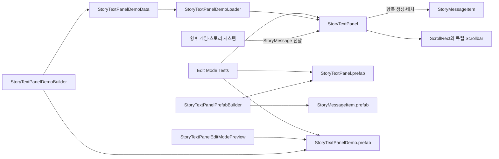

# TxT-RPG 프로젝트 문서

이 디렉터리는 프로젝트의 구조, 클래스와 Unity 오브젝트의 책임, 자산 관계, 개발 절차를 설명합니다. 새로운 기능을 분석하거나 수정할 때 필요한 관련 문서를 이곳에서 볼 수 있습니다.

## 문서 목록

| 문서 | 설명 |
| --- | --- |
| [프로젝트 구조](architecture/project-structure.md) | 디렉터리, 어셈블리, 런타임·Editor·테스트 경계를 설명합니다. |
| [StoryTextPanel 설계](architecture/story-text-panel.md) | 클래스, 프리팹, 데이터 흐름, 스크롤과 투명도 동작을 설명합니다. |
| [CharacterDisplayPanel 설계](architecture/character-display-panel.md) | 캐릭터 표시 요청, 2D View, 외형 정의, 전환과 향후 3D 확장 경계를 설명합니다. |
| [EnemyDisplayPanel 설계](architecture/enemy-display-panel.md) | 다중 적의 인스턴스 식별, 2D View 풀, 포메이션과 향후 3D Backend 경계를 설명합니다. |
| [ActionGridPanel 설계](architecture/action-grid-panel.md) | 아이템·스킬 공통 그리드, 개발자 표시 프리셋, 반응형 배치, 선택, 컨텍스트 메뉴와 명령 실행 경계를 설명합니다. |
| [FlexibleLayoutPanel 설계](architecture/flexible-layout-panel.md) | UI 영역의 재귀 분할, 가중치·고정 크기, 최소·최대 크기와 반응형 축 정책을 설명합니다. |
| [Addressables 에셋 관리](architecture/asset-management.md) | Provider, Lease, 화면 Scope, 안정적인 ID와 수명 기반 그룹 정책을 설명합니다. |
| [Panel Startup 설계](architecture/panel-startup.md) | 초기 데이터와 자산 준비, 레이아웃 확정, 등장 연출과 입력 활성화 순서를 설명합니다. |
| [Scene Transition 설계](architecture/scene-transition.md) | AppScene, Additive 콘텐츠 교체, 초기화 계약, 전체 화면 효과와 실패 복구 흐름을 설명합니다. |
| [캐릭터와 플레이어 Gameplay 도메인](architecture/character-domain.md) | 캐릭터 스탯·체력·피해 계산, 플레이어 소유 목록과 복수 캐릭터 저장 경계를 설명합니다. |
| [캐릭터 콘텐츠 구성](architecture/character-content.md) | Gameplay Definition과 UI Appearance를 묶는 콘텐츠 원본, 카탈로그와 제작 검증 절차를 설명합니다. |
| [PlayerSession과 새 게임 초기화](architecture/player-session.md) | 기본 캐릭터 선택, 저장 복원, AppScene 수명과 운영 캐릭터 UI 연결을 설명합니다. |
| [TMP_MainScene 기본 표시와 Preview](architecture/main-scene-default-presentation.md) | 배포용 대체 표시, 상태 구분, 운영 Scene 연결과 격리된 Preview를 설명합니다. |
| [캐릭터 상태 UI 설계](architecture/character-status-ui.md) | 선택적 상태 Element, HealthBarPanel과 외형·상태 Binder 분리를 설명합니다. |
| [개발 및 검증 절차](development/workflows.md) | 프리팹 재생성, 데모 미리보기, 테스트와 변경 시 확인 사항을 설명합니다. |
| [점진 생성 탐험 노드 트리](architecture/exploration-node-tree.md) | 선택·미선택 기록, 지연 후보 생성, 탐험 체력·전투 연결과 반응형 노드 선택 카드 구조를 설명합니다. |
| [임시 적 전투](architecture/temporary-combat.md) | 격리된 플레이어·적 체력, 주사위 효과 적용, 적 행동 예고와 Scene 수명 경계를 설명합니다. |
| [설정 가능한 주사위 Gameplay 도메인](architecture/dice-domain.md) | 면별 효과·수치 구성, 런타임 변경, 외부 면 판정과 결과 스냅샷 계약을 설명합니다. |
| [Main Scene 시각 개선 제안안](development/main-scene-visual-proposal.md) | 원본과 격리된 제안 Scene의 구성, 생성·실행·비교 절차와 검증 범위를 설명합니다. |
| [등록 기반 Prefab Rebuild](architecture/prefab-rebuild-registry.md) | 안전한 생성 작업의 명시적 등록, 계획 검증, 실행과 제외 정책을 설명합니다. |
| [한국어 TMP 대체 폰트](architecture/korean-font-fallback.md) | 기존 영문 폰트를 유지하는 전역 Noto Sans KR fallback, 라이선스, 적용과 검증 절차를 설명합니다. |

## 작업 지침서

기능별 작업 지침서의 목록과 설명은 [작업 지침서 목록](instructions/README.md)에서 볼 수 있습니다.

## 현재 구현 범위

현재 프로젝트에서 직접 구현한 제품 UI 기능은 메시지 표시 영역인 `StoryTextPanel`, 캐릭터 표시 영역인 `CharacterDisplayPanel`, 다중 적 표시 영역인 `EnemyDisplayPanel`, 아이템·스킬 선택 영역인 `ActionGridPanel`과 이 영역들을 재귀적으로 조합하는 `FlexibleLayoutPanel`입니다. 기본 Unity 샘플 씬과 튜토리얼 자산은 제품 아키텍처에 포함하지 않습니다.

`StoryTextPanel` 기능은 다음 영역으로 분리되어 있습니다.

```mermaid
flowchart LR
    Game[향후 게임·스토리 시스템] -->|StoryMessage 전달| Panel[StoryTextPanel]
    Panel -->|항목 생성·배치| Item[StoryMessageItem]
    Panel --> Scroll[ScrollRect와 독립 Scrollbar]

    DemoData[StoryTextPanelDemoData] --> DemoLoader[StoryTextPanelDemoLoader]
    DemoLoader --> Panel

    PrefabBuilder[StoryTextPanelPrefabBuilder] --> PanelPrefab[StoryTextPanel.prefab]
    PrefabBuilder --> ItemPrefab[StoryMessageItem.prefab]
    DemoBuilder[StoryTextPanelDemoBuilder] --> DemoData
    DemoBuilder --> DemoPrefab[StoryTextPanelDemo.prefab]
    Preview[StoryTextPanelEditModePreview] --> DemoPrefab

    Tests[Edit Mode Tests] --> Panel
    Tests --> PanelPrefab
    Tests --> DemoPrefab
```

## 문서 사용 원칙

- 클래스나 프리팹의 책임을 변경할 때 관련 아키텍처 문서를 함께 수정합니다.
- 새 어셈블리, 주요 디렉터리, 실행 진입점 또는 데이터 흐름을 추가하면 프로젝트 구조 문서를 수정합니다.
- Editor 메뉴나 생성 절차가 바뀌면 개발 및 검증 절차 문서를 수정합니다.
- 문서에 기재된 경로, 클래스명, 메뉴명은 실제 프로젝트와 일치해야 합니다.
- 구현되지 않은 계획은 현재 구조처럼 서술하지 않고 별도의 후속 작업으로 구분합니다.

- [퀵 아이템과 게임 창](architecture/quick-items-and-game-windows.md): 인벤토리, 퀵 슬롯, 게임 메뉴와 공통 모달의 현재 구현을 설명합니다.

- [탐험 기록 트리](architecture/exploration-history-tree.md): 기록 표시, 부모 연결, 스크롤과 이미지·효과 경계를 설명합니다.

- [탐험 기록 트리 검증](development/verification/exploration-tree-validation.md): 적용 상태, 입력·이미지·긴 기록 검사와 화면별 제약을 기록합니다.
