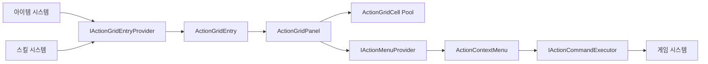

# ActionGridPanel 설계

## 목적과 책임

`ActionGridPanel`은 아이템, 스킬, 장비와 퀘스트 아이템을 동일한 선택 UI에 표시합니다. 각 도메인 모델은 합치지 않으며 UI 경계에서만 `ActionGridEntry`로 변환합니다.



`ActionGridPanel`은 사용 가능 여부의 게임 규칙을 판정하거나 아이템과 스킬을 직접 실행하지 않습니다. 외부 시스템이 표시 데이터, 가능한 명령과 비동기 실행 결과를 제공합니다.

## 운영용 Prefab

```text
ActionGridPanel
├── Header
│   ├── Title
│   └── CategoryTabs
├── Scroll View
│   ├── Viewport
│   │   └── Content
│   └── Scrollbar
├── EmptyState
└── ContextMenuAnchor
    └── ActionContextMenu
```

개별 셀은 `Assets/TxTRPG/UI/Prefabs/ActionGridCell.prefab`으로 분리하며 다음 상태를 표현합니다.

```text
ActionGridCell
├── Border
├── ContentRoot
│   ├── Icon
│   ├── Quantity
│   ├── CooldownOverlay
│   ├── StateOverlay
│   ├── ShortcutLabel
│   └── EmptySlot
├── SelectionFrame
```

`ActionGridCell` 루트는 `GridLayoutGroup`이 위치와 크기를 제어하는 레이아웃 전용 Transform입니다. 테두리 색상과 Outline은 `Border`에 적용하고, 흔들림·확대·회전·노이즈 같은 항목 연출은 `ContentRoot`에 적용합니다. 셀 루트에 Animator가 위치나 크기를 기록하면 GridLayoutGroup의 재배치와 충돌할 수 있으므로 사용하지 않습니다.

컨텍스트 메뉴는 `Assets/TxTRPG/UI/Prefabs/ActionContextMenu.prefab`이며 선택한 항목에 대해 외부 `IActionMenuProvider`가 반환한 옵션만 동적으로 표시합니다.

## 데이터 및 명령 경계

`ActionGridEntry`는 UI에 전달되는 일시적인 표현 모델이므로 Sprite를 포함할 수 있습니다. 저장 데이터에는 이 구조체나 Sprite 참조를 기록하지 않고 안정적인 아이템·스킬 ID를 저장해야 합니다.

`ActionMenuOption`은 실행 Delegate를 포함하지 않으며 명령 ID, 표시 이름, 활성 상태와 비활성 사유만 전달합니다. 실제 실행은 `IActionCommandExecutor.ExecuteAsync`로 위임합니다. 패널이 파괴되거나 다른 명령이 시작되면 이전 취소 토큰을 취소합니다.

## 선택과 입력

기본 `Activation Behavior`는 `Open Context Menu`입니다. 셀의 `Button`은 EventSystem의 Point와 Submit 입력을 함께 처리하므로 마우스, 터치, 키보드와 게임패드에서 동일한 활성화 경로를 사용합니다.

셀 Navigation은 현재 열 수를 이용하여 상하좌우 대상을 명시적으로 연결합니다. 컨텍스트 메뉴를 닫으면 이전 셀로 포커스를 복원합니다. 선택 상태와 명령 실행은 분리되므로 셀을 선택하는 동작만으로 게임 명령이 실행되지 않습니다.

`Activation Behavior`의 설정은 다음과 같습니다.

| 값 | 동작 |
| --- | --- |
| `Select Only` | 선택 표시와 상세 정보 갱신만 수행합니다. |
| `Open Context Menu` | 선택 후 외부 제공자의 명령 목록을 표시합니다. |
| `Execute Default Action` | 외부 제공자가 반환한 첫 번째 활성 명령을 실행합니다. |

## 반응형 레이아웃

| 모드 | 동작 |
| --- | --- |
| `Fixed Columns` | 개발자가 설정한 값을 최대 열 수로 사용합니다. 너비가 부족하면 최소 셀 너비를 기준으로 열 수를 줄이고 남은 셀을 다음 행에 배치합니다. |
| `Adaptive Cell Size` | Viewport 너비, 최소 셀 크기와 간격을 이용하여 열 수를 계산합니다. |

두 모드 모두 최소 셀 너비보다 좁게 셀을 압축하지 않습니다. `Fixed Columns`는 설정한 최대값을 넘지 않으며 `Adaptive Cell Size`는 현재 너비에 들어가는 열을 모두 사용합니다. 셀 묶음은 `Upper Center`로 정렬되므로 최대 셀 크기에 도달하고 좌우 여백이 남아도 한쪽으로 치우치지 않습니다.

레이아웃은 `OnRectTransformDimensionsChange`와 목록 갱신 시에만 계산합니다. 매 프레임 `Update`에서 계산하지 않습니다. 최소·최대 셀 크기와 Inspector의 `Spacing (X, Y)`, Padding을 통해 셀 간격과 외곽 여백을 설정할 수 있습니다.

인벤토리 용량과 화면 배치는 분리합니다. `Population Mode`가 `Entries Only`이면 데이터 셀만 표시하고, `Fill Capacity With Empty Slots`이면 `Capacity`까지 빈 슬롯을 표시합니다.

## 풀링과 갱신

패널은 필요한 수만큼 셀을 생성한 뒤 목록 갱신 시 재사용합니다. Demo Prefab에 저장된 Edit Mode 미리보기 셀도 Play Mode 시작 시 풀에 편입되므로 중복 셀이 생성되지 않습니다. 현재 초기 구현은 수십 개 규모의 목록을 대상으로 하며 수백 개 이상에서는 별도의 가상화가 필요합니다.

## Demo

`Assets/TxTRPG/UI/DEMO/ActionGridPanel/ActionGridPanelDemo.prefab`은 아이템과 스킬, 수량, 비활성 상태, 쿨다운, 단축키, 선택 프레임과 컨텍스트 메뉴를 Edit Mode에서 함께 보여줍니다.

Play Mode에서는 `ActionGridPanelDemoController`가 동일한 데이터를 운영용 API로 다시 바인딩하고 옵션 제공자와 명령 실행기 예제를 연결합니다. Demo의 아이콘과 명령 결과는 검증 전용입니다.
