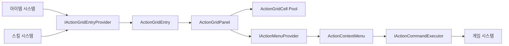

# ActionGridPanel 설계

## 목적과 책임

`ActionGridPanel`은 아이템, 스킬, 장비와 퀘스트 아이템을 동일한 선택 UI에 표시합니다. 각 도메인 모델은 합치지 않으며 UI 경계에서만 `ActionGridEntry`로 변환합니다.



`ActionGridPanel`은 사용 가능 여부의 게임 규칙을 판정하거나 아이템과 스킬을 직접 실행하지 않습니다. 외부 시스템이 표시 데이터, 가능한 명령과 비동기 실행 결과를 제공합니다.

## 운영용 Prefab

```text
ActionGridPanel
├── Header
│   ├── Title
│   └── CategoryTabs
├── Scroll View
│   ├── Viewport
│   │   └── Content
│   └── Scrollbar
├── EmptyState
└── ContextMenuAnchor
    └── ActionContextMenu
```

개별 셀은 `Assets/TxTRPG/UI/Prefabs/ActionGridCell.prefab`으로 분리하며 다음 상태를 표현합니다.

```text
ActionGridCell
├── Border
├── ContentRoot
│   ├── Icon
│   ├── Quantity
│   ├── CooldownOverlay
│   ├── StateOverlay
│   ├── ShortcutLabel
│   └── EmptySlot
├── SelectionFrame
```

`ActionGridCell` 루트는 `GridLayoutGroup`이 위치와 크기를 제어하는 레이아웃 전용 Transform입니다. 테두리 색상과 Outline은 `Border`에 적용하고, 흔들림·확대·회전·노이즈 같은 항목 연출은 `ContentRoot`에 적용합니다. 셀 루트에 Animator가 위치나 크기를 기록하면 GridLayoutGroup의 재배치와 충돌할 수 있으므로 사용하지 않습니다.

컨텍스트 메뉴는 `Assets/TxTRPG/UI/Prefabs/ActionContextMenu.prefab`이며 선택한 항목에 대해 외부 `IActionMenuProvider`가 반환한 옵션만 동적으로 표시합니다. `ContextMenuAnchor`는 패널 전체를 덮는 마스크 밖 오버레이 좌표계입니다. 메뉴는 선택 셀의 RectTransform을 이 좌표계로 변환하여 오른쪽, 왼쪽, 아래쪽, 위쪽 순으로 배치 가능한 위치를 선택하고, 마지막으로 패널 경계 안에 좌표를 제한합니다.

## 데이터 및 명령 경계

`ActionGridEntry`는 UI에 전달되는 일시적인 표현 모델이므로 Sprite를 포함할 수 있습니다. 저장 데이터에는 이 구조체나 Sprite 참조를 기록하지 않고 안정적인 아이템·스킬 ID를 저장해야 합니다.

`ActionMenuOption`은 실행 Delegate를 포함하지 않으며 명령 ID, 표시 이름, 활성 상태와 비활성 사유만 전달합니다. 실제 실행은 `IActionCommandExecutor.ExecuteAsync`로 위임합니다. 패널이 파괴되거나 다른 명령이 시작되면 이전 취소 토큰을 취소합니다.

## 선택과 입력

기본 `Activation Behavior`는 `Open Context Menu`입니다. 셀의 `Button`은 EventSystem의 Point와 Submit 입력을 함께 처리하므로 마우스, 터치, 키보드와 게임패드에서 동일한 활성화 경로를 사용합니다.

셀 Navigation은 현재 열 수를 이용하여 상하좌우 대상을 명시적으로 연결합니다. 컨텍스트 메뉴를 닫으면 위치 기준으로 사용했던 셀로 포커스를 복원합니다. 위치 기준 RectTransform과 포커스 복구 GameObject는 별도로 전달하므로 두 책임이 섞이지 않습니다. 선택 상태와 명령 실행은 분리되므로 셀을 선택하는 동작만으로 게임 명령이 실행되지 않습니다.

`Activation Behavior`의 설정은 다음과 같습니다.

| 값 | 동작 |
| --- | --- |
| `Select Only` | 선택 표시와 상세 정보 갱신만 수행합니다. |
| `Open Context Menu` | 선택 후 외부 제공자의 명령 목록을 표시합니다. |
| `Execute Default Action` | 외부 제공자가 반환한 첫 번째 활성 명령을 실행합니다. |

## 반응형 레이아웃

| 모드 | 동작 |
| --- | --- |
| `Fixed Columns` | 개발자가 설정한 값을 최대 열 수로 사용합니다. 너비가 부족하면 최소 셀 너비를 기준으로 열 수를 줄이고 남은 셀을 다음 행에 배치합니다. |
| `Adaptive Cell Size` | Viewport 너비, 최소 셀 크기와 간격을 이용하여 열 수를 계산합니다. |

두 모드 모두 최소 셀 너비보다 좁게 셀을 압축하지 않습니다. `Fixed Columns`는 설정한 최대값을 넘지 않으며 `Adaptive Cell Size`는 현재 너비에 들어가는 열을 모두 사용합니다. 기본 `Center` 정렬에서는 최대 셀 크기에 도달하고 좌우 여백이 남아도 슬롯 행이 한쪽으로 치우치지 않습니다.

레이아웃은 `OnRectTransformDimensionsChange`와 목록 갱신 시에만 계산합니다. 매 프레임 `Update`에서 계산하지 않습니다. 최소·최대 셀 크기와 Inspector의 `Spacing (X, Y)`, Padding을 통해 셀 간격과 외곽 여백을 설정할 수 있습니다.

`Grid Alignment`는 완성된 전체 열 묶음을 Viewport 안에서 Left, Center, Right로 정렬하며 기본값은 Center입니다. `Incomplete Row Alignment`는 현재 열 수보다 활성 Cell이 적은 마지막 행만 정렬하며 기본값은 Left입니다. 두 설정은 Entry 순서나 Fill Direction을 변경하지 않습니다. Start Corner는 Upper Left, Start Axis는 Horizontal로 유지되므로 데이터 순서는 왼쪽에서 오른쪽, 위에서 아래로 유지됩니다.

`Vertical Placement`는 `Top`과 `Center When Content Fits`를 제공합니다. Top은 슬롯 수와 관계없이 위쪽부터 배치합니다. Center When Content Fits는 실제 표시 Cell이 Viewport 안에 모두 들어오면 전체 슬롯 묶음을 세로 중앙에 배치하고, 필요한 높이가 Viewport를 0.5px보다 많이 초과하면 자동으로 상단 배치와 아래 방향 스크롤로 전환합니다. 수평 Grid Alignment와 Incomplete Row Alignment는 이 세로 정책과 독립적으로 유지됩니다.

ActionGridPanel은 표시 Cell 수, 현재 열 수, Cell 높이, 세로 Spacing과 Padding으로 필요한 그리드 높이를 계산하고 Content 높이를 `max(Viewport 높이, 필요한 그리드 높이)` 정책으로 직접 관리합니다. 운영 Prefab의 Content에는 `ContentSizeFitter`를 두지 않습니다. 이전 Prefab 인스턴스에 충돌하는 ContentSizeFitter가 남아 있으면 런타임 초기화 시 비활성화하여 높이 소유권이 중복되지 않도록 합니다. `Entries Only`는 Entry 수를, `Fill Capacity With Empty Slots`는 빈 슬롯을 포함한 Capacity를 높이 계산에 사용합니다.

슬롯 제거나 화면 확장으로 overflow 상태에서 fitting 상태로 전환되면 ScrollRect의 관성과 스크롤 위치를 상단으로 초기화한 뒤 가운데 정렬합니다. Content의 상단 Anchor와 Pivot은 변경하지 않으며 GridLayoutGroup의 `Upper*`와 `Middle*` 정렬만 전환하므로, 런타임 중 Anchor 변경으로 인한 위치 이동을 방지합니다.

`Compact Forward`는 Entry 제거 후 데이터 인덱스를 먼저 압축하며, 불완전 행 정렬은 압축된 활성 Cell 결과에만 적용됩니다. `Entries Only`에서는 Entry Cell 수를 기준으로 마지막 행을 판단합니다. `Fill Capacity With Empty Slots`에서는 빈 슬롯도 활성 Cell이므로 Capacity까지 포함한 수를 기준으로 판단하며, 마지막 행이 열 수만큼 차 있으면 추가 offset을 적용하지 않습니다.

`ConfigurableScrollbarController`는 스크롤바 표시 상태와 Viewport 예약 영역이 실제로 변경될 때 `ViewportLayoutChanged`를 발생시킵니다. `ActionGridPanel`은 이 알림을 구독하여 같은 호출 흐름에서 열 수와 슬롯 정렬을 다시 계산하므로 한 프레임 지연에 의존하지 않습니다. 공용 컨트롤러는 StoryTextPanel 같은 기존 사용처의 Auto 동작을 유지하기 위해 콘텐츠 높이와 Viewport 크기 변화를 감시하지만, 값이 실제로 달라진 경우에만 `Refresh()`를 호출하며 매 프레임 레이아웃을 재계산하지 않습니다.

ActionGridPanel Prefab의 기본 스크롤바 설정은 `Hidden + ReserveWhenVisible`입니다. 기존 세 Space Mode에서는 Hidden이 스크롤바와 예약 공간을 모두 제거합니다. 새 `ReserveSymmetricallyAlways`만 Visibility와 관계없이 대칭 공간을 유지합니다. Auto는 overflow가 있을 때만 표시되며, ReserveWhenVisible에서는 전체 폭으로 overflow를 먼저 평가한 뒤 실제 표시 시에만 Width + Gap을 예약합니다. Always는 항상 표시하고, ReserveAlways와 ReserveWhenVisible은 공간을 예약하며 Overlay는 Viewport 위에 겹쳐 표시합니다.

`ReserveSymmetricallyAlways`는 기존 세 enum 값 뒤에 추가된 대칭 예약 정책입니다. Visibility와 Side에 관계없이 Viewport의 왼쪽에는 `Width + Gap`, 오른쪽에는 `-(Width + Gap)`을 적용합니다. 스크롤바가 Hidden 또는 Auto 비표시 상태여도 양쪽 여백을 유지하며, Left와 Right는 실제 스크롤바의 위치만 결정합니다. SampleScene의 `Main_FlexibleLayoutPanel/ActionGridPanel`은 `Hidden + ReserveSymmetricallyAlways + Grid Center + Center When Content Fits`를 사용합니다.

`Scroll View/OppositeScrollbarArea`는 RectTransform만 가진 비상호작용 공간 표현입니다. 대칭 모드에서 실제 Scrollbar 반대편에 배치되며 두 RectTransform의 너비는 항상 `Width`로 같습니다. `Gap`은 영역 너비에 포함되지 않고 각 영역과 Viewport 사이의 간격으로만 사용되므로 전체 좌우 inset은 각각 `Width + Gap`입니다. Hidden과 Auto 비표시 상태에서도 Opposite 영역과 대칭 inset은 유지됩니다. 다른 Space Mode에서는 Opposite 영역을 비활성화합니다.

운영 Prefab의 `Scroll View` 외부 수평 여백은 왼쪽과 오른쪽 모두 18px입니다. 따라서 기본 `Width = 16`, `Gap = 8`인 대칭 모드에서는 ActionGridPanel 전체 기준 좌우 공간이 각각 `18 + 16 + 8 = 42px`로 같고, Viewport와 슬롯 영역의 중심도 패널 중심과 일치합니다. `Sliding Area`의 수평 inset은 Handle의 시각적 두께만 결정하며 Scrollbar 루트와 Opposite 영역의 레이아웃 너비에는 영향을 주지 않습니다.

Width 변경은 Scrollbar 루트와 Opposite 영역의 너비를 함께 바꾸며, Gap 변경은 두 너비를 유지하고 Viewport offset만 변경합니다. Side 변경은 두 영역의 좌우 위치만 교환합니다. 기존 Prefab에 Opposite 참조가 없어도 대칭 Viewport inset은 유지되며 Editor와 Development Build에서는 누락 경고를 한 번 출력합니다.

현재 구현은 Inspector 또는 런타임 API로 공간 예약 모드를 명시적으로 선택합니다. 화면 너비에 따라 대칭 예약 정책을 자동 전환하는 Breakpoint 기능은 아직 구현하지 않았으며, 향후 추가할 경우 현재 enum 설정을 덮어쓰지 않는 별도의 반응형 정책 계층으로 제공해야 합니다.

런타임에서는 `SetGridAlignment()`와 `SetIncompleteRowAlignment()`로 두 정렬을 독립적으로 변경합니다. 기존 `slotAlignment` 직렬화 이름은 `FormerlySerializedAs`로 `gridAlignment`에 승계됩니다. 호환용 `SetSlotAlignment()`는 기존 동작을 보존하기 위해 두 정렬을 함께 변경하지만 새 코드에서는 사용하지 않습니다.

인벤토리 용량과 화면 배치는 분리합니다. `Population Mode`가 `Entries Only`이면 데이터 셀만 표시하고, `Fill Capacity With Empty Slots`이면 `Capacity`까지 빈 슬롯을 표시합니다. 운영용 Prefab의 기본값은 `Fill Capacity With Empty Slots`이므로 초기 데이터가 없어도 Capacity만큼 빈 슬롯이 보입니다.

## 용량과 Entry 변경

`Initial Capacity`는 Play Mode 초기화 시 준비하는 셀 풀의 최소 크기입니다. 기존 Prefab 미리보기 셀을 먼저 풀에 편입한 뒤 부족한 셀만 생성합니다. 런타임에서는 `SetCapacity()`, `TryAddEntry()`, `TryInsertEntry()`, `RemoveEntry()`, `UpdateEntry()`, `ReplaceEntry()`, `ClearEntries()`로 목록을 변경합니다.

`Awake()`는 풀 생성 직후 현재 Population Mode에 따라 셀 활성화와 빈 슬롯 바인딩을 한 번 수행합니다. 따라서 별도의 초기 데이터 Loader가 없어도 빈 슬롯이 표시됩니다. 외부 시스템이 `TryAddEntry`, `TryInsertEntry` 또는 `SetEntries`로 아이템·스킬을 등록하면 해당 위치의 빈 슬롯이 실제 Entry 표현으로 교체되며 나머지 슬롯은 유지됩니다. 런타임에 직렬화 설정을 변경한 뒤 즉시 반영해야 할 때는 `InitializeVisibleSlots()`를 호출합니다.

`Compact Forward`에서는 중간 Entry를 제거하면 뒤의 Entry가 앞으로 이동하며, `Preserve Slots`에서는 제거한 인덱스를 빈 슬롯으로 유지합니다. Entry 식별에는 셀 인덱스 대신 `EntryInstanceId`를 사용합니다. 현재 호환성을 위해 `EntryInstanceId`는 기존 `Id`의 별칭입니다.

용량 축소 정책은 다음과 같습니다.

| 정책 | 동작 |
| --- | --- |
| `Reject If Occupied` | 잘리는 Entry가 있으면 변경을 거부하는 안전한 기본값입니다. |
| `Move Overflow` | UI에서 제외한 Entry를 `Overflowed` 이벤트로 외부 시스템에 전달합니다. |
| `Remove Overflow` | UI 목록에서만 제거하며 도메인 아이템 삭제를 의미하지 않습니다. |

선택한 Entry가 제거되면 같은 위치의 다음 Entry, 그다음 이전 Entry 순서로 선택을 복원합니다. 열려 있던 컨텍스트 메뉴는 닫습니다. 비동기 아이콘 결과는 기존 인덱스가 아니라 `EntryInstanceId`를 다시 검색한 후 적용합니다.

## 스크롤바

`ConfigurableScrollbarController`는 `Hidden`, `Auto`, `Always` 가시성, 공간 예약 방식, 좌우 배치, 너비와 간격을 관리합니다. 핸들 크기는 콘텐츠 비율, 정규화 고정값, 픽셀 고정값 또는 최소 픽셀 크기를 사용할 수 있습니다. 컨트롤러가 `ScrollRect`와 값을 양방향 동기화하므로 고정 크기 모드에서도 Unity가 핸들 크기를 덮어쓰지 않습니다.

`ScrollbarStyle` ScriptableObject에서 배경과 핸들의 Sprite, Color, Material 및 배경 표시 여부를 공통 설정할 수 있습니다.

## 풀링과 갱신

패널은 필요한 수만큼 셀을 생성한 뒤 목록 갱신 시 재사용합니다. Demo Prefab에 저장된 Edit Mode 미리보기 셀도 Play Mode 시작 시 풀에 편입되므로 중복 셀이 생성되지 않습니다. 현재 초기 구현은 수십 개 규모의 목록을 대상으로 하며 수백 개 이상에서는 별도의 가상화가 필요합니다.

## Demo

`Assets/TxTRPG/UI/DEMO/ActionGridPanel/ActionGridPanelDemo.prefab`은 아이템과 스킬, 수량, 비활성 상태, 쿨다운, 단축키, 선택 프레임과 컨텍스트 메뉴를 Edit Mode에서 함께 보여줍니다.

Play Mode에서는 `ActionGridPanelDemoController`가 동일한 데이터를 운영용 API로 다시 바인딩하고 옵션 제공자와 명령 실행기 예제를 연결합니다. Demo의 아이콘과 명령 결과는 검증 전용입니다.
