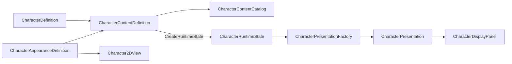

# 캐릭터 콘텐츠 구성

## 현재 책임과 의존 방향

`TxTRPG.Content`는 캐릭터의 게임 규칙과 화면 표현을 한 에셋에서 찾을 수 있도록 조합하지만 각 원본의 책임은 변경하지 않습니다.



- `CharacterDefinition`은 기본 스탯과 Definition ID를 소유합니다.
- `CharacterAppearanceDefinition`은 Character ID와 Addressable Sprite ID·프레이밍을 소유합니다.
- `CharacterContentDefinition`은 두 원본, 표시 이름 현지화 키와 검색용 태그를 조합합니다.
- `CharacterContentCatalog`는 이미 로드된 가벼운 Content Definition을 ID로 조회합니다.
- `CharacterPresentationFactory`는 `CharacterRuntimeState`를 UI 표시 요청으로 변환합니다.

`TxTRPG.Gameplay`은 Content나 UI를 참조하지 않습니다. `TxTRPG.UI`는 상태 변환을 위해 Gameplay만 참조하고, 조합 계층인 `TxTRPG.Content`가 Gameplay와 UI를 함께 참조합니다. 이 방향으로 인해 게임 규칙에 Sprite, Addressables Handle 또는 Panel 참조가 유입되지 않습니다.

## 콘텐츠 유효성 규칙

유효한 `CharacterContentDefinition`은 다음 조건을 모두 충족해야 합니다.

- Gameplay Definition과 Appearance Definition이 모두 지정되어 있어야 합니다.
- Gameplay의 `CharacterDefinitionId`가 비어 있지 않아야 합니다.
- Appearance의 `CharacterId`가 Gameplay Definition ID와 대소문자까지 일치해야 합니다.
- 모든 Appearance Variant와 빈 Appearance·Pose·Expression 요청으로 해석되는 기본 artwork에 Addressable Asset ID가 있어야 합니다.
- 프로젝트의 모든 Character Content Definition에서 Definition ID가 고유해야 합니다.

Editor fallback Sprite만 존재하고 Addressable Asset ID가 비어 있는 구성은 플레이어 빌드에서 실패할 수 있으므로 유효한 제품 콘텐츠로 인정하지 않습니다. `Tools > TxT RPG > Validate Character Content` 메뉴는 프로젝트 전체 에셋을 검색하여 위 조건과 중복 ID를 검사합니다. `CharacterContentCatalog`도 런타임 인덱스를 처음 구축할 때 같은 검사를 실행하므로 잘못된 콘텐츠를 조용히 사용하지 않습니다.

## 생성과 표시 흐름

고정 캐릭터는 다음 흐름으로 생성합니다.

```csharp
var content = catalog.GetRequired("character.knight");
var state = content.CreateRuntimeState("owned-character-0001");
playerState.AddCharacter(state);

var presentation = presentationFactory.Create(state);
characterDisplayPanel.ShowCharacter(presentation);
```

Content Definition은 새로운 ScriptableObject를 런타임에 만들지 않고 연결된 Gameplay Definition으로 독립적인 `CharacterRuntimeState`를 생성합니다. `CharacterDisplayPanel`은 Content Definition이나 `PlayerState`를 받지 않고 계속 `CharacterPresentation`만 받습니다.

현재 카탈로그는 Inspector 목록에 직접 연결된 가벼운 정의를 한 번 Dictionary로 구성하는 동기식 Repository입니다. 실제 Sprite는 Content Definition과 함께 로드하지 않으며, `Character2DView`가 `CharacterAppearanceDefinition`의 Asset ID를 통해 필요할 때 로드하고 교체 시 기존 Lease를 해제합니다.

## 현재 범위와 후속 단계

현재 구현에는 고정 캐릭터 Content Definition, 동기식 카탈로그, 전체 프로젝트 검증 메뉴와 Gameplay→UI Presentation 변환기가 포함됩니다.

다음 기능은 아직 구현하지 않았습니다.

- `CharacterVisualState`, 생성 Snapshot과 Innate Stat Modifier
- 시드 기반 `CharacterGenerator`와 Generation Profile
- Character 저장 버전 4의 외형·선천 스탯 데이터
- Content Definition 자체를 Addressables로 불러오는 비동기 Repository와 Lease
- 활성 캐릭터 변경을 구독하는 Scene Presenter 또는 Binder
- Character Definition·Appearance·Content·Generation Profile을 함께 만드는 제작 마법사

랜덤 생성과 저장 형식 변경은 고정 콘텐츠의 실제 연결을 검증한 뒤 별도 변경으로 추가합니다. 런타임에서 생성된 캐릭터는 Addressable 에셋을 새로 만들지 않고, 미리 등록된 외형 Asset ID 중 하나만 저장하고 선택해야 합니다.
