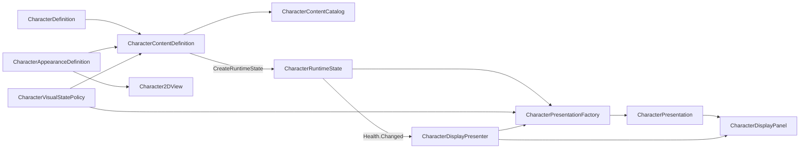

# 캐릭터 콘텐츠 구성

## 현재 책임과 의존 방향

`TxTRPG.Content`는 캐릭터의 게임 규칙과 화면 표현을 한 에셋에서 찾을 수 있도록 조합하지만 각 원본의 책임은 변경하지 않습니다.



- `CharacterDefinition`은 기본 스탯과 Definition ID를 소유합니다.
- `CharacterAppearanceDefinition`은 Character ID와 Addressable Sprite ID·프레이밍을 소유합니다.
- `CharacterVisualStatePolicy`는 현재 체력으로 `normal`, `injured`, `critical`, `defeated` 상태를 판정합니다.
- `CharacterContentDefinition`은 Gameplay, Appearance와 선택적 상태 정책, 표시 이름 현지화 키와 검색용 태그를 조합합니다.
- `CharacterContentCatalog`는 이미 로드된 가벼운 Content Definition을 ID로 조회합니다.
- `CharacterPresentationFactory`는 `CharacterRuntimeState`를 UI 표시 요청으로 변환합니다.
- `CharacterDisplayPresenter`는 Health 변경 구독 수명을 관리하고 시각 상태가 실제로 달라질 때만 패널을 갱신합니다.

`TxTRPG.Gameplay`은 Content나 UI를 참조하지 않습니다. `TxTRPG.UI`는 상태 변환을 위해 Gameplay만 참조하고, 조합 계층인 `TxTRPG.Content`가 Gameplay와 UI를 함께 참조합니다. 이 방향으로 인해 게임 규칙에 Sprite, Addressables Handle 또는 Panel 참조가 유입되지 않습니다.

## 콘텐츠 유효성 규칙

유효한 `CharacterContentDefinition`은 다음 조건을 모두 충족해야 합니다.

- Gameplay Definition과 Appearance Definition이 모두 지정되어 있어야 합니다.
- Gameplay의 `CharacterDefinitionId`가 비어 있지 않아야 합니다.
- Appearance의 `CharacterId`가 Gameplay Definition ID와 대소문자까지 일치해야 합니다.
- 모든 Appearance Variant와 빈 Appearance·Visual State·Pose·Expression 요청으로 해석되는 기본 artwork에 Addressable Asset ID가 있어야 합니다.
- 같은 요청에 동시에 일치하며 구체성 점수도 같은 Variant 조합이 없어야 합니다.
- 상태 정책을 사용한다면 임계값은 `0 <= critical < injured <= 1`이어야 합니다.
- 프로젝트의 모든 Character Content Definition에서 Definition ID가 고유해야 합니다.

Editor fallback Sprite만 존재하고 Addressable Asset ID가 비어 있는 구성은 플레이어 빌드에서 실패할 수 있으므로 유효한 제품 콘텐츠로 인정하지 않습니다. `Tools > TxT RPG > Content > Characters > Validate All` 메뉴는 프로젝트 전체 에셋을 검색하여 위 조건과 중복 ID를 검사합니다. `CharacterContentCatalog`도 런타임 인덱스를 처음 구축할 때 같은 검사를 실행하므로 잘못된 콘텐츠를 조용히 사용하지 않습니다.

## 생성과 표시 흐름

고정 캐릭터는 다음 흐름으로 생성합니다.

```csharp
var content = catalog.GetRequired("character.knight");
var state = content.CreateRuntimeState("owned-character-0001");
playerState.AddCharacter(state);

characterDisplayPresenter.Bind(state, content);
```

Content Definition은 새로운 ScriptableObject를 런타임에 만들지 않고 연결된 Gameplay Definition으로 독립적인 `CharacterRuntimeState`를 생성합니다. `CharacterDisplayPanel`은 Content Definition이나 `PlayerState`를 받지 않고 계속 `CharacterPresentation`만 받습니다.

현재 카탈로그는 Inspector 목록에 직접 연결된 가벼운 정의를 한 번 Dictionary로 구성하는 동기식 Repository입니다. 실제 Sprite는 Content Definition과 함께 로드하지 않으며, `Character2DView`가 `CharacterAppearanceDefinition`의 Asset ID를 통해 필요할 때 로드하고 교체 시 기존 Lease를 해제합니다.

## 현재 범위와 후속 단계

현재 구현에는 고정 캐릭터 Content Definition, 체력 기반 시각 상태 정책, 동기식 카탈로그, 전체 프로젝트 검증 메뉴, Gameplay→UI Presentation 변환기·Presenter와 `CharacterAuthoringWindow`가 포함됩니다. 제작 창은 입력만 수집하며 `CharacterContentAssetFactory`가 경로 계산, 전체 사전 검증, Gameplay·Appearance·VisualStatePolicy·Content의 네 에셋 생성과 연결, 카탈로그 및 선택적 Addressables 등록을 담당합니다.

Factory는 자동 고유 경로를 만들거나 기존 파일을 덮어쓰지 않습니다. 생성 전에 경로, Definition ID, 스탯, 상태 임계값, Variant 모호성, 저장된 Sprite·Catalog, Addressables 주소와 기존 Sprite 등록을 모두 검사합니다. 같은 Texture 또는 Sprite Sheet의 Sprite는 하나의 base address를 공유하며 Factory가 GUID별로 한 번만 등록하고 각 Variant에는 `baseAddress[spriteName]`을 저장합니다. 중간 실패 시 이번 실행에서 생성한 에셋과 폴더를 역순으로 제거하고 카탈로그 변경 및 여러 새 Addressables 엔트리를 모두 복구합니다.

`CharacterPresentation`의 기존 생성자는 유지되며 새 상태 축을 사용하는 생성자가 별도로 추가되었습니다. 따라서 기존 positional 호출의 Pose·Expression·Animation 의미는 변경되지 않습니다. `Character2DView`는 Character·Appearance·VisualState·Pose·Expression이 같으면 Sprite를 다시 로드하지 않으며, 빠르게 상태가 바뀌면 진행 중인 이전 요청을 취소하고 늦게 완료된 결과를 적용하지 않습니다.

Addressables 등록 기능은 `TxTRPG.Editor.Common`의 `AddressableAssetRegistration`에 있습니다. `TxTRPG.UI.Editor.AddressableAssetEditor`는 기존 메뉴와 공개 메서드를 보존하면서 공용 구현에 위임합니다. Character Authoring은 기존 Sprite 등록을 암묵적으로 이동하지 않고 충돌로 처리하며, 기존 UI 등록 흐름은 이전과 같이 요청한 그룹과 주소로 갱신할 수 있습니다.

`Tools > TxT RPG > Content > Characters > Create Default Placeholder Content`는 외부 원화가 없는 초기 환경에서도 `character.default`를 재현할 수 있게 합니다. 이 메뉴는 Demo 자산을 참조하지 않고 별도의 Texture2D·Sprite 하위 에셋을 만들며, 표준 네 상태와 카탈로그 및 Addressables를 함께 연결합니다. 실제 원화로 교체하는 작업은 Appearance Variant에 한정되며 Gameplay 및 저장 ID는 유지됩니다.

다음 기능은 아직 구현하지 않았습니다.

- 생성 Snapshot과 Innate Stat Modifier
- 시드 기반 `CharacterGenerator`와 Generation Profile
- Character 저장 버전 4의 외형·선천 스탯 데이터
- Content Definition 자체를 Addressables로 불러오는 비동기 Repository와 Lease
- `PlayerState.ActiveCharacterChanged`와 Scene 수명을 연결하는 상위 Binder
- Generation Profile과 스킨 Variant까지 함께 편집하는 고급 제작 마법사
- 상태 진입·반복·종료 애니메이션과 이중 Image 기반 Cross Fade

랜덤 생성과 저장 형식 변경은 고정 콘텐츠의 실제 연결을 검증한 뒤 별도 변경으로 추가합니다. 런타임에서 생성된 캐릭터는 Addressable 에셋을 새로 만들지 않고, 미리 등록된 외형 Asset ID 중 하나만 저장하고 선택해야 합니다.
