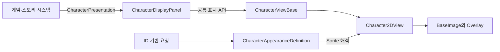

# CharacterDisplayPanel 설계

## 책임과 경계

`CharacterDisplayPanel`은 게임 또는 스토리 시스템에서 전달한 `CharacterPresentation`을 현재 View로 전달하고, 캐릭터와 독립적인 패널 배경 요청을 공통 배경 렌더러에 위임합니다. 패널은 `Image`, `Animator`, 모델 또는 RenderTexture를 직접 제어하지 않습니다.



| 구성 요소 | 역할 |
| --- | --- |
| `CharacterPresentation` | 캐릭터, 외형, 포즈, 표정, 애니메이션 ID와 좌우 반전 여부를 전달합니다. Unity 자산을 참조하지 않습니다. |
| `ICharacterView` | 2D와 향후 3D View가 제공해야 하는 최소 표시 API를 정의합니다. |
| `CharacterViewBase` | 표시 상태와 선택 가능한 등장·퇴장 페이드를 관리합니다. |
| `CharacterDisplayPanel` | 활성 View에 표시, 갱신, 애니메이션, 효과, 숨김과 초기화 요청을 전달합니다. |
| `PanelBackgroundRenderer` | 배경 A/B 슬롯, 효과 Overlay, 교차 페이드, Addressables Lease와 Material 수명을 관리합니다. |
| `PanelBackgroundStyle` | 배경 Sprite ID, Tint, Opacity, Material, 표시 방식과 효과 정책을 정의합니다. |
| `Character2DView` | Sprite 해석, UI Image, 좌우 반전, Animator와 효과 재생을 담당합니다. |
| `CharacterAppearanceDefinition` | 캐릭터 ID와 외형·포즈·표정 조합을 실제 Sprite에 연결합니다. |
| `CharacterEffectPlayer` | 선택적으로 연결된 Animator의 효과 상태를 재생하고 초기화합니다. |

## Prefab 계층

`Assets/TxTRPG/UI/Prefabs/CharacterDisplayPanel.prefab`은 다음 계층을 사용합니다.

```text
CharacterDisplayPanel
├── BackgroundLayer
│   └── BackgroundViewport
│       └── BackgroundVisualRoot
│           ├── BackgroundA
│           ├── BackgroundB
│           └── BackgroundEffectOverlay
├── DisplayRoot
│   └── Character2DView
│       └── FrameViewport
│           └── VisualRoot
│               └── ArtworkRoot
│                   ├── BaseImage
│                   ├── SkinOverlay
│                   └── EffectOverlay
├── ForegroundEffectLayer
└── TransitionOverlay
```

`FrameViewport`의 `RectMask2D`는 원본 전신 일러스트가 표시 영역을 벗어나는 부분을 잘라냅니다. `ArtworkRoot`는 선택한 원본 구간을 패널에 맞추는 프레이밍 계산만 담당하고, `VisualRoot`는 호흡·흔들림·등장 애니메이션을 담당합니다. 두 Transform을 분리하므로 런타임 구도 갱신이 Animator의 위치와 크기 값을 덮어쓰지 않습니다.

`TransitionOverlay`는 향후 패널 단위 전환 효과를 추가할 자리입니다. 현재는 비활성 Image이며, 등장·퇴장 페이드는 View의 `CanvasGroup`이 담당합니다.

`BackgroundEffectOverlay`는 배경에만 적용되는 효과, Character2DView의 `EffectOverlay`는 캐릭터에만 적용되는 효과를 담당합니다. `ForegroundEffectLayer`는 캐릭터 앞의 안개나 빗방울 같은 표현을 위한 자리이며, `TransitionOverlay`는 배경과 캐릭터를 함께 덮는 전환용입니다. 모든 Image는 기본적으로 Raycast를 차단하지 않습니다.

`PanelBackgroundRenderer`는 FlexibleLayoutPanel에서도 사용하는 공통 구현입니다. 기존 `FlexibleLayoutBackground`와 `FlexibleLayoutBackgroundStyle`은 직렬화와 자산 호환성을 위한 래퍼로 유지됩니다. 배경 로드가 실패하면 스타일에 설정된 Editor Fallback을 사용하며, 연속 요청이나 비활성화 시 진행 중 요청과 Lease를 정리합니다.

## 외형 해석

`CharacterAppearanceDefinition` 하나는 한 `CharacterId`에 대응합니다. Variant의 비어 있지 않은 ID는 요청 ID와 정확히 일치해야 하며, 빈 ID는 해당 축의 기본값으로 동작합니다. 조건을 충족하는 Variant가 여러 개이면 외형·포즈·표정 ID를 더 많이 명시한 항목을 선택하고, 일치 항목이 없으면 `Fallback Sprite`를 사용합니다.

ID 비교는 대소문자를 구분합니다. 스토리 데이터와 외형 정의에서 안정적으로 재사용할 수 있는 ID 규칙을 유지해야 합니다.

## 전신·반신 일러스트 프레이밍

외형 정의의 `Fallback Framing`과 각 Variant의 `Framing`에서 다음 프리셋을 선택할 수 있습니다.

| 프리셋 | 용도 |
| --- | --- |
| `Whole Artwork` | 원본 전체를 표시합니다. 이미 반신으로 제작된 일러스트에 적합합니다. |
| `Thigh Up` | 원본 아래쪽 약 22%를 제외한 구간을 표시 영역에 채웁니다. 전신 원본을 허벅지 위 구도로 사용할 때 적합합니다. |
| `Custom` | `Custom Visible Rect`로 원본에서 보여줄 정규화 영역을 직접 설정합니다. |

`Additional Scale`은 선택한 구도에서 추가로 확대하며, `Pixel Offset`은 최종 화면 위치를 미세 조정합니다. 프레이밍 계산은 화면 비율이나 패널 크기가 바뀔 때 다시 실행되며 Sprite의 종횡비를 유지합니다.

원본마다 머리와 발의 여백이 다르므로 모든 전신 일러스트에 하나의 고정 Crop 값을 사용하지 않습니다. 캐릭터와 외형별로 프레이밍을 저장해야 표정·포즈 교체 시 얼굴 위치가 불필요하게 이동하지 않습니다.

## 표시 전환

`CharacterViewBase`의 Inspector에서 다음 항목을 설정할 수 있습니다.

| 항목 | 동작 |
| --- | --- |
| `Animate Visibility` | 등장·퇴장 Fade 사용 여부를 결정합니다. 기본값은 `false`이며 Scene 시작 Fade는 `SceneTransitionService`가 담당합니다. |
| `Show Duration` | 완전히 투명한 상태에서 완전히 표시될 때까지의 시간입니다. |
| `Hide Duration` | 현재 투명도에서 완전히 숨겨질 때까지의 시간입니다. |
| `Maximum Frame Delta` | 한 프레임이 비정상적으로 길 때 전환이 건너뛰지 않도록 누적 시간의 상한을 정합니다. |

`Animate Visibility`를 활성화한 경우 등장 Fade는 View를 활성화한 즉시 투명도를 0으로 설정하고 첫 렌더링 프레임을 진행률 0으로 유지합니다. 다음 프레임부터 `Time.unscaledDeltaTime`을 제한하여 누적하므로 게임 일시 정지의 영향을 받지 않으며 시작 시점의 불투명도 튐을 방지합니다.

## 3D 확장 경계

3D 표시가 필요해지면 `CharacterViewBase`를 상속하는 `Character3DView`를 추가하고 `CharacterDisplayPanel.SetView`로 교체합니다. 권장 방식은 별도 카메라와 스테이지를 RenderTexture에 렌더링하여 `RawImage`로 표시하는 것입니다. 현재 구현에는 RenderTexture, 카메라, 모델 로딩 코드가 포함되지 않습니다.

## 런타임 사용 예시

```csharp
[SerializeField] private CharacterDisplayPanel characterDisplayPanel;

public void ShowMira()
{
    var presentation = new CharacterPresentation(
        characterId: "mira",
        appearanceId: "winter",
        poseId: "idle",
        expressionId: "worried",
        animationId: "breathing");

    characterDisplayPanel.ShowCharacter(presentation);
}

public void ChangeLocation(PanelBackgroundStyle locationStyle)
{
    characterDisplayPanel.ChangeBackground(locationStyle, 0.35f);
}
```

## 데모와 Edit Mode 미리보기

`Assets/TxTRPG/UI/DEMO/CharacterDisplayPanel/CharacterDisplayPanelDemo.prefab`은 운영용 패널 Prefab을 중첩하고 전용 샘플 Sprite와 외형 정의를 연결합니다. Prefab Mode에서 열면 Play Mode를 시작하지 않아도 캐릭터 영역의 앵커, 종횡비와 기본 배치를 확인할 수 있습니다.

Play Mode에서는 `CharacterDisplayPanelDemoLoader`가 동일한 데모 데이터를 `CharacterPresentation`으로 변환하여 실제 표시 API를 실행합니다. 기본 설정에서는 즉시 표시하며, `Animate Visibility`를 활성화한 경우에만 캐릭터 자체의 등장 Fade를 실행합니다. 샘플 Texture와 Sprite는 데모 검증 전용이며 운영 캐릭터 자산으로 사용하지 않습니다.

`Assets/Scenes/TMP_MainScene.unity`의 운영 패널은 Demo Loader를 사용하지 않습니다. `ActiveCharacterDisplayBinder`가 AppScene의 `PlayerSessionHost`에서 `PlayerState.ActiveCharacter`를 가져오고, `CharacterContentCatalog`를 통해 `CharacterDisplayPresenter`만 갱신합니다. 표시 Sprite의 Addressables 로드가 완료될 때까지 Binder의 Scene readiness도 완료되지 않으므로, Scene 전환 화면이 불완전한 첫 표시를 드러내지 않습니다. 이름과 Health 같은 선택적 상태 표시는 `ActiveCharacterStatusBinder`가 별도의 `CharacterStatusPanel`에 전달합니다.
