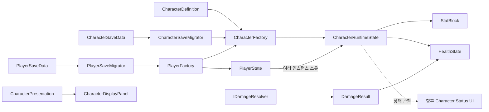

# 캐릭터와 플레이어 Gameplay 도메인 설계

## 목적과 경계

`TxTRPG.Gameplay`은 캐릭터의 스탯, 체력, 피해 계산과 플레이어가 소유한 캐릭터 상태를 소유합니다. `TxTRPG.UI`의 `CharacterPresentation`은 외형 요청만 전달하며 Gameplay 어셈블리를 참조하지 않습니다. UI와 전투 화면은 상태 이벤트를 관찰할 수 있지만 도메인 객체는 `CharacterDisplayPanel`, Unity UI, Scene 또는 Addressables를 참조하지 않습니다.

## 기본 데이터와 런타임 상태

| 형식 | 책임 |
| --- | --- |
| `StatId` | 저장과 콘텐츠에서 사용하는 대소문자 구분 안정 ID를 나타냅니다. |
| `CoreStatIds` | `core.attack_power`, `core.max_health` 접근자를 제공합니다. |
| `BaseStatEntry` | Inspector에서 직렬화할 기본 Stat ID와 정수 값을 보관합니다. |
| `StatBlock` | 기본값과 영구 보너스를 결합한 읽기 전용 최종 스탯을 제공합니다. |
| `CharacterDefinition` | 캐릭터 ID와 기본 스탯을 보관하는 변경 불가능한 콘텐츠 원본 역할을 합니다. |
| `CharacterRuntimeState` | Definition ID와 소유 인스턴스 ID를 구분하고 독립적인 `StatBlock`과 `HealthState`를 소유합니다. |
| `CharacterFactory` | Definition ID 중복을 거부하고 명시적인 Instance ID로 신규 상태를 생성하거나 저장 상태를 복원합니다. |
| `PlayerState` | 소유 캐릭터 목록과 활성 캐릭터를 관리하고 목록 불변 조건을 보장합니다. |
| `PlayerFactory` | 초기 캐릭터 한 명을 가진 플레이어를 생성하거나 `PlayerSaveData`를 복원합니다. |

`CharacterDefinition`은 `Assets > Create > TxT RPG > Characters > Character Definition`에서 만듭니다. 모든 Definition에는 고유한 `Character Id`, `core.attack_power`, `core.max_health`가 필요합니다. 기본 스탯은 음수일 수 없으며 최대 체력은 1 이상이어야 합니다. 같은 Stat ID가 중복되거나 필수 스탯이 없으면 런타임 상태 생성을 명시적으로 거부합니다.

현재 `StatBlock`은 기본값과 저장 대상인 영구 정수 보너스만 계산합니다. 저장 데이터의 알 수 없는 Stat ID는 로드를 중단하지 않고 `IgnoredBonusStatIds`에 기록합니다. 장비, Buff와 Debuff용 Flat·AdditivePercent·MultiplicativePercent Modifier 및 출처별 제거 기능은 아직 구현하지 않았습니다.

## 캐릭터 식별과 플레이어 상태

`CharacterDefinitionId`는 `CharacterDefinition` 콘텐츠를 찾는 안정적인 ID이고, `CharacterInstanceId`는 플레이어가 소유한 개별 캐릭터를 찾는 ID입니다. 같은 Definition으로 여러 캐릭터를 생성해도 각 인스턴스는 서로 다른 체력과 스탯 상태를 가집니다. `CharacterFactory.Create(characterDefinitionId, characterInstanceId)`는 호출자가 결정한 Instance ID를 사용하며 내부에서 무작위 ID를 생성하지 않습니다.

기존 `CharacterId` 프로퍼티와 `CharacterSaveData.characterId`는 이전 호출자와 저장 데이터의 호환성을 위해 유지됩니다. 새 코드는 `CharacterDefinitionId`, `CharacterInstanceId`, `characterDefinitionId`, `characterInstanceId`를 사용해야 합니다. 매개변수가 하나인 기존 생성 API는 Definition ID를 Instance ID로도 사용하는 호환 경로이므로, 같은 Definition을 둘 이상 소유할 때에는 사용하지 않습니다.

`PlayerState`는 다음 불변 조건을 적용합니다.

- 플레이어는 최소 한 명의 캐릭터를 소유해야 합니다.
- `CharacterInstanceId`는 플레이어 안에서 중복될 수 없습니다.
- 활성 캐릭터는 반드시 소유 목록에 있어야 합니다.
- 마지막 캐릭터는 제거할 수 없습니다.
- 활성 캐릭터를 제거하면 목록에서 그다음 캐릭터를 선택하고, 마지막 항목이었다면 이전 캐릭터를 선택합니다.

활성 캐릭터가 실제로 바뀌면 `ActiveCharacterChanged` 이벤트가 발생합니다. 공개된 `Characters` 컬렉션은 읽기 전용이며 추가와 제거는 `PlayerState` 메서드를 통해서만 수행합니다. 피해와 회복은 `PlayerState`가 아니라 구체적인 `CharacterRuntimeState`에 적용합니다.

## 체력 규칙

`HealthState`는 현재 체력을 외부에서 직접 수정하지 못하게 하고 다음 메서드만 제공합니다.

- `ApplyDamage`는 음수 입력을 거부하고 0 아래로 감소시키지 않습니다.
- `Heal`은 음수 입력을 거부하고 최대 체력을 넘지 않습니다.
- `RestoreToFull`은 현재 최대 체력까지 회복합니다.
- `SetMaximum`은 최대 체력이 감소하면 현재 체력을 새 최대치로 제한하고, 최대치가 증가해도 자동 회복하지 않습니다.

변경 시 `Changed` 이벤트와 `HealthChangeResult`를 전달합니다. `Defeated` 이벤트는 체력이 양수에서 0이 되는 순간에만 발생하므로, 전투 불능 상태에서 추가 피해를 받아도 반복되지 않습니다.

## 피해 계산

`IDamageResolver`는 피해 공식과 체력 변경을 분리합니다. 현재 `PassthroughDamageResolver`는 음수가 아닌 `BaseDamage`를 그대로 반환합니다. `DamageResult`는 감소된 피해와 증폭된 피해를 모두 표현할 수 있으므로 이후 방어력, 저항, 취약, 치명타를 Resolver 구현에 추가할 수 있습니다. 계산된 `FinalDamage`만 `HealthState.ApplyDamage`에 전달합니다.

## 저장과 마이그레이션

`CharacterSaveData`의 현재 버전은 3입니다. Definition ID, Instance ID, 현재 체력과 영구 스탯 보너스를 저장하고 Definition의 기본값과 최종 계산 결과는 저장하지 않습니다. `PlayerSaveData` 버전 1은 활성 Character Instance ID와 복수 `CharacterSaveData` 목록을 저장합니다.

- Character 버전 1 데이터는 영구 보너스가 없는 현재 데이터로 변환합니다.
- Character 버전 1과 2의 `characterId`는 `characterDefinitionId`로 변환하고 Instance ID는 항상 `legacy-character-0`으로 결정합니다.
- 기존 단일 `CharacterSaveData`는 `PlayerSaveMigrator.FromLegacyCharacter`를 통해 캐릭터 한 명과 같은 활성 ID를 가진 `PlayerSaveData`로 감쌉니다.
- 지원 범위 밖의 Character 또는 Player 저장 버전은 명시적으로 거부합니다.
- 로드된 현재 체력은 0부터 계산된 최대 체력 사이로 보정합니다.
- 존재하지 않는 Definition ID, 중복 Instance ID와 존재하지 않는 활성 Instance ID는 조용히 복구하지 않고 명시적으로 실패합니다.
- `CharacterSaveSerializer`와 `PlayerSaveSerializer`는 `JsonUtility` 기반 인메모리 JSON 변환만 담당합니다.

임시 파일 기록, 원자적 교체, 이전 정상 파일 백업과 플랫폼별 저장 경로는 아직 구현하지 않았습니다. 이 책임은 향후 Persistence 어셈블리의 파일 저장소가 담당해야 하며 Gameplay DTO나 ScriptableObject 참조를 파일에 직접 기록해서는 안 됩니다.

## 확장 계획

- 출처 ID가 있는 Stat Modifier와 결정적인 계산 순서를 추가합니다.
- 방어력, 피해 감소, 관통, 치명타, 저항, 보호막용 `IDamageResolver` 구현을 추가합니다.
- 장비·레벨·영구 상태를 저장하는 버전별 마이그레이션을 추가합니다.
- 애플리케이션 수명의 세션 서비스가 현재 `PlayerState`를 소유하도록 연결합니다.
- UI 어셈블리 바깥의 Presenter가 Health 이벤트를 UI 표시 모델로 변환하도록 구성합니다.

이 항목들은 현재 구현된 기본값, 영구 보너스, 체력, 기본 피해, 복수 캐릭터 소유와 저장 마이그레이션과 구분되는 후속 범위입니다. `PlayerState`는 순수 C# 객체이며 현재 Scene의 `AppRoot` 또는 영속 세션에는 아직 연결하지 않았습니다.
