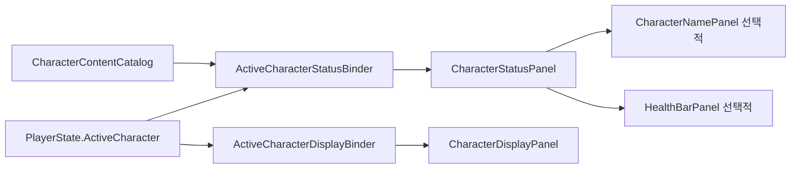

# 캐릭터 상태 UI 설계

## 책임 분리

캐릭터 상태 UI는 Gameplay 상태를 소유하지 않습니다. `ActiveCharacterStatusBinder`가 `PlayerState.ActiveCharacter`를 관찰하여 표시 모델을 만들고, 선택적으로 배치된 `CharacterStatusPanel`에 전달합니다. 캐릭터 외형은 별도의 `ActiveCharacterDisplayBinder`가 담당합니다.



`TMP_MainScene`에는 상태 UI나 `ActiveCharacterStatusBinder`를 기본 배치하지 않습니다. 상태 UI가 없는 화면은 정상적인 구성이고 캐릭터 외형 및 Scene 초기화에 영향을 주지 않습니다.

## 조합형 컨테이너

`CharacterStatusPanel`은 `CharacterStatusElement` 목록만 관리합니다. Inspector에서 자식 Element를 한 번 수집하거나 `Register`와 `Unregister`로 런타임 요소를 추가할 수 있습니다. 상태 적용 시 매 프레임 자식 계층을 검색하지 않습니다. 런타임 등록 시 이미 적용된 최신 표시 모델이 있으면 새 요소에도 즉시 전달합니다.

`CharacterStatusPresentation`은 현재 필요한 이름과 Health 표시 모델만 포함합니다. 공격력과 다른 일반 Stat은 포함하지 않으며, 추후 `CharacterStatWindow`와 별도의 표시 모델로 구현합니다.

## HealthBarPanel

`Assets/TxTRPG/UI/Prefabs/HealthBarPanel.prefab`은 다음 계층을 사용합니다.

```text
HealthBarPanel
├── BackgroundLayer
│   └── BackgroundVisualRoot
│       └── Background
├── BarRoot
│   └── BarVisualRoot
│       ├── Slider
│   │   ├── Background
│   │   └── Fill Area
│   │       └── Fill
│   │           └── FillVisualRoot
│   │               └── FillImage
│       ├── BarEffectOverlay
│       └── BorderVisualRoot
├── TextLayer
│   └── TextVisualRoot
│       ├── LabelText
│       └── ValueText
├── ForegroundEffectLayer
└── TransitionOverlay
```

Slider는 표시 전용입니다. `Interactable = false`, `Navigation = None`, Handle 없음, `minValue = 0`, `wholeNumbers = true`를 유지합니다. 현재값과 최댓값은 `HealthPresentation`에서 받고, 문구는 Binder의 `IHealthTextFormatter`가 결정합니다. Label 또는 Value Text 참조가 없으면 해당 표시만 생략합니다.

`HealthBarLayoutController`는 애니메이션하지 않는 `BackgroundLayer`의 사각형을 기준으로 `BarRoot`만 배치합니다. 새 기본값은 양 축 `Stretch`, 사방 Padding 12, 가로 `Center`, 세로 `Middle`입니다. 따라서 520×64 기준 영역에서는 BarRoot와 Slider의 효과 전 크기가 496×40이 됩니다. 문구는 Overlay이므로 문구 유무가 이 크기에 영향을 주지 않습니다.

Padding은 Canvas 로컬 UI 단위이며, 비대칭 Padding을 사용하면 Center는 Padding을 제외한 영역의 중앙을 의미합니다. Padding 합이 기준 크기를 넘으면 저장된 원본 값은 유지하고 계산에 사용하는 두 값을 비례 축소하여 결과 크기를 0으로 제한합니다. 음수 Padding과 NaN·무한대 크기 또는 Offset은 안전한 0으로 보정합니다. Offset은 계산이 끝난 뒤 적용하므로 의도적으로 Padding 경계 밖으로 이동할 수 있습니다.

기존 직렬화 데이터와 API의 호환성을 위해 축별 `Fixed` 모드와 `Fixed Size`는 유지합니다. Fixed 축은 가용 크기와 Fixed Size 중 작은 값을 사용하고 남은 영역에서 Left·Center·Right 또는 Bottom·Middle·Top으로 정렬합니다. Stretch 축은 Padding 내부를 모두 채우므로 해당 축의 Alignment 값은 결과에 영향을 주지 않습니다. 기준 참조가 없거나 패널 밖을 가리키거나 `BarRoot`와 순환 관계이면 패널 루트를 안전한 기준으로 사용합니다.

`BarRoot`는 레이아웃 전용이므로 흔들림·확대·회전·셰이더 효과를 직접 적용하지 않습니다. 전체 바 효과는 `BarVisualRoot`, 채우기 효과는 `FillVisualRoot`, 테두리 효과는 `BorderVisualRoot`, 문구 효과는 `TextVisualRoot`에 적용합니다. 배경과 전경 효과도 각각 `BackgroundVisualRoot`와 `ForegroundEffectLayer`에 격리합니다. 이 구조에서는 런타임 정렬 변경이 효과 Transform을 덮어쓰지 않습니다.

`HealthBarEffect` 구현은 이전 값, 새 값과 최초 적용 여부를 받습니다. 등록 직후 이미 값이 있거나 비활성 상태에서 다시 활성화되면 최초 동기화로 적용하며, 최초 동기화는 피해 사건으로 취급하지 않습니다. 등록 해제, 컴포넌트 비활성화, 패널 비활성화·파괴 또는 효과 전체 비활성화 시에는 `Clear()`가 실행되어 Coroutine과 임시 시각 상태를 정리합니다. `HealthBarScalePulseEffect`는 피해 시 `BarVisualRoot`만 확대했다가 복구하는 작은 예제입니다. 효과 구현에서 공유 Material 자체를 변경하지 말고 인스턴스 속성이나 별도 Material 인스턴스를 사용해야 합니다.

Label과 Value Text는 Slider 위의 `TextLayer`에 겹쳐 표시되며 각각 왼쪽과 오른쪽 절반을 사용합니다. 기본 Prefab은 자동 글자 크기 조절과 말줄임을 사용하므로 긴 현지화 문구가 바깥으로 넘치지 않습니다.

## 운영 Prefab과 바인딩

| 자산 | 용도 |
| --- | --- |
| `HealthBarPanel.prefab` | Health 요소만 필요한 화면에 사용하는 운영 Prefab입니다. |
| `CharacterStatusPanel.prefab` | HealthBarPanel을 기본 자식으로 포함한 조합 예시이자 운영 시작점입니다. |

사용하려는 화면에 `CharacterStatusPanel.prefab`을 배치한 뒤 같은 Scene의 적절한 오브젝트에 `ActiveCharacterStatusBinder`를 추가합니다. Binder의 Status Panel과 Character Catalog를 연결합니다. 이름이 필요하면 별도의 `CharacterNamePanel`을 컨테이너 자식으로 추가하고 `ICharacterNameLocalizer`를 주입합니다.

운영 Scene 생성기는 상태 UI를 자동 생성하지 않습니다. 이전 버전 생성기가 만든 `CharacterStatusPanel/AttackPowerText` 구조만 재생성 과정에서 제거하며, 개발자가 새 조합형 Prefab으로 배치한 상태 UI는 수정하지 않습니다.
