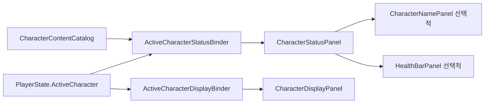

# 캐릭터 상태 UI 설계

## 책임 분리

캐릭터 상태 UI는 Gameplay 상태를 소유하지 않습니다. `ActiveCharacterStatusBinder`가 `PlayerState.ActiveCharacter`를 관찰하여 표시 모델을 만들고, 선택적으로 배치된 `CharacterStatusPanel`에 전달합니다. 캐릭터 외형은 별도의 `ActiveCharacterDisplayBinder`가 담당합니다.



`TMP_MainScene`에는 상태 UI나 `ActiveCharacterStatusBinder`를 기본 배치하지 않습니다. 상태 UI가 없는 화면은 정상적인 구성이고 캐릭터 외형 및 Scene 초기화에 영향을 주지 않습니다.

## 조합형 컨테이너

`CharacterStatusPanel`은 `CharacterStatusElement` 목록만 관리합니다. Inspector에서 자식 Element를 한 번 수집하거나 `Register`와 `Unregister`로 런타임 요소를 추가할 수 있습니다. 상태 적용 시 매 프레임 자식 계층을 검색하지 않습니다. 런타임 등록 시 이미 적용된 최신 표시 모델이 있으면 새 요소에도 즉시 전달합니다.

`CharacterStatusPresentation`은 현재 필요한 이름과 Health 표시 모델만 포함합니다. 공격력과 다른 일반 Stat은 포함하지 않으며, 추후 `CharacterStatWindow`와 별도의 표시 모델로 구현합니다.

## HealthBarPanel

`Assets/TxTRPG/UI/Prefabs/HealthBarPanel.prefab`은 다음 계층을 사용합니다.

```text
HealthBarPanel
├── BackgroundLayer
├── BarRoot
│   ├── Slider
│   │   ├── Background
│   │   └── Fill Area
│   │       └── Fill
│   └── BarEffectOverlay
├── TextLayer
│   ├── LabelText
│   └── ValueText
├── ForegroundEffectLayer
└── TransitionOverlay
```

Slider는 표시 전용입니다. `Interactable = false`, `Navigation = None`, Handle 없음, `minValue = 0`, `wholeNumbers = true`를 유지합니다. 현재값과 최댓값은 `HealthPresentation`에서 받고, 문구는 Binder의 `IHealthTextFormatter`가 결정합니다. Label 또는 Value Text 참조가 없으면 해당 표시만 생략합니다.

구체적인 점멸, 흔들림, 글리치 또는 셰이더 효과는 `HealthBarPanel`에 내장하지 않습니다. `HealthBarEffect` 구현을 등록하면 이전 값, 새 값과 최초 적용 여부를 받아 상태 기반 효과와 사건 기반 효과를 독립적으로 구현할 수 있습니다. Slider의 즉시 값 갱신과 시각적 보간도 효과 컴포넌트에서 분리하여 처리합니다.

## 운영 Prefab과 바인딩

| 자산 | 용도 |
| --- | --- |
| `HealthBarPanel.prefab` | Health 요소만 필요한 화면에 사용하는 운영 Prefab입니다. |
| `CharacterStatusPanel.prefab` | HealthBarPanel을 기본 자식으로 포함한 조합 예시이자 운영 시작점입니다. |

사용하려는 화면에 `CharacterStatusPanel.prefab`을 배치한 뒤 같은 Scene의 적절한 오브젝트에 `ActiveCharacterStatusBinder`를 추가합니다. Binder의 Status Panel과 Character Catalog를 연결합니다. 이름이 필요하면 별도의 `CharacterNamePanel`을 컨테이너 자식으로 추가하고 `ICharacterNameLocalizer`를 주입합니다.

운영 Scene 생성기는 상태 UI를 자동 생성하지 않습니다. 이전 버전 생성기가 만든 `CharacterStatusPanel/AttackPowerText` 구조만 재생성 과정에서 제거하며, 개발자가 새 조합형 Prefab으로 배치한 상태 UI는 수정하지 않습니다.
