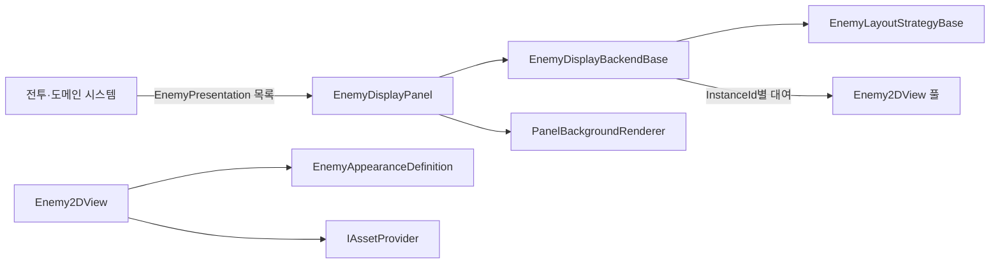

# EnemyDisplayPanel 설계

## 목적과 경계

`EnemyDisplayPanel`은 전투 화면의 여러 적을 표시합니다. 단일 캐릭터 연출을 담당하는 `CharacterDisplayPanel`을 상속하지 않으며, 배경 표현과 시작 전환만 공통 컴포넌트를 조합하여 사용합니다. 전투 규칙, 체력 계산, 타깃 선정 규칙과 저장 데이터는 이 패널의 책임이 아닙니다.

적 종류는 `EnemyPresentation.EnemyId`, 전투에 등장한 개별 적은 `InstanceId`로 식별합니다. 같은 종류의 적이 여러 마리 등장할 수 있으므로 갱신, 제거, 애니메이션, 효과와 타깃 표시는 항상 `InstanceId`를 사용해야 합니다.



## 런타임 책임

| 형식 | 책임 |
| --- | --- |
| `EnemyPresentation` | Unity 자산을 참조하지 않는 개별 적 표시 상태를 전달합니다. |
| `EnemyDisplayPanel` | 목록 정렬, 중복 제거, 단일 타깃 정규화와 Backend 호출을 조율합니다. |
| `EnemyDisplayBackendBase` | 2D와 향후 3D 표현이 구현해야 하는 목록·상태·연출 계약입니다. |
| `Enemy2DDisplayBackend` | `InstanceId`별 View 유지, 제거된 View 회수, 최대 표시 수와 포메이션 적용을 담당합니다. |
| `Enemy2DView` | Sprite, 프레이밍, 좌우 반전, 타깃·패배 Overlay와 의미 기반 연출을 표시합니다. |
| `EnemyAppearanceDefinition` | `EnemyId`, 외형 ID와 자세 ID를 Addressables Sprite에 연결합니다. |
| `EnemyLayoutStrategyBase` | 적 수와 표시 영역을 받아 View 위치, 크기와 표시 순서를 계산합니다. |
| `ResponsiveHorizontalEnemyLayoutStrategy` | 행마다 가운데 정렬하고 좁은 영역에서는 크기를 제한 범위까지 축소한 뒤 다음 행으로 배치합니다. |

## Prefab 계층

```text
EnemyDisplayPanel
├── BackgroundLayer
│   └── BackgroundViewport
│       └── BackgroundVisualRoot
├── EnemyDisplayRoot
│   └── Enemy2DBackend
│       ├── EnemyViewHost
│       └── PoolRoot
│           └── Enemy2DViewTemplate
│               ├── FrameViewport
│               │   └── VisualRoot
│               │       └── ArtworkRoot
│               ├── TargetMarker
│               └── DefeatedOverlay
├── ForegroundEffectLayer
└── TransitionOverlay
```

`FrameViewport`는 원본이 전신 이미지여도 지정한 가시 영역만 보여 줍니다. 위치·크기 애니메이션은 레이아웃이 관리하는 View 루트가 아니라 `VisualRoot` 아래에 적용합니다. `TargetMarker`와 `DefeatedOverlay`는 게임 입력을 가로채지 않습니다.

## 자산 수명과 풀 재사용

`Enemy2DView`는 `EnemyAppearanceDefinition`에서 안정적인 Addressables ID를 찾고 `IAssetProvider`로 Sprite를 비동기 로드합니다. 로드 요청에는 View의 현재 `InstanceId`가 함께 검증되므로, View가 풀에 반환된 뒤 과거 요청이 완료되어도 새 적의 이미지를 덮어쓰지 않습니다. 교체·취소·회수·파괴 시에는 해당 `AssetLease<Sprite>`를 해제합니다.

목록을 다시 설정해도 같은 `InstanceId`의 View는 유지됩니다. 사라진 View만 풀에 반환하며 새 인스턴스가 필요할 때 풀을 우선 사용합니다. `Maximum Visible Enemies`보다 많은 항목이 들어오면 Backend는 허용된 수만 표시하고 경고를 남깁니다.

## 현재 구현과 후속 확장

현재는 Sprite 기반 `Enemy2DDisplayBackend`와 반응형 수평·다중 행 포메이션을 구현했습니다. 의미 기반 애니메이션 ID는 `EnemyAnimationBinding`에서 Animator 상태로 명시적으로 연결합니다.

3D 적 표현은 아직 구현하지 않았습니다. 추가할 때에는 적마다 별도 3D Stage를 만들지 않고, 하나의 공유 Stage가 여러 적 모델과 카메라를 관리하는 `EnemyDisplayBackendBase` 구현으로 추가합니다. 전투 포메이션 규칙과 3D 월드 좌표 변환도 해당 Backend 또는 전용 전략에 한정해야 합니다.
