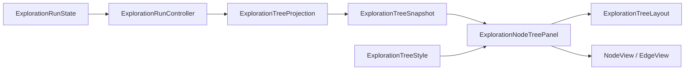

# 탐험 기록 트리

탐험 기록은 기존 `Canvas/MainScreenViewport/Main_FlexibleLayoutPanel/ContentLayer/NodeTreePanel` 안에 표시합니다. 패널 이름, 부모의 FlexibleLayoutItem, 형제 순서, 여백과 배경은 유지합니다. 실제 노드 선택은 기존 후보 카드에서만 수행합니다. 노드와 선에는 Button과 Raycast가 없습니다.

## 책임과 데이터 흐름

| 구성 | 책임 |
| --- | --- |
| `ExplorationRunController` | 세션 바인딩, 선택 성공, 완료 후 후보 생성, 전투 패배와 미등록 처리기 실패 경계에서 트리를 갱신합니다. |
| `ExplorationTreeProjection` | 전체 Nodes와 SelectedPath를 불변 표시 스냅샷으로 변환합니다. 도메인을 변경하지 않습니다. |
| `ExplorationTreeSnapshot` / `ExplorationTreeLayout` | ID 검증, Depth·SiblingIndex·ID 순서, 중앙 정렬과 부모 연결점 계산을 담당합니다. |
| `ExplorationNodeTreePanel` | 스크롤, 최신 위치 따라가기, 노드·선 View의 풀링과 표시 영역 가상화를 담당합니다. |
| `ExplorationTreeNodeView` / `ExplorationTreeEdgeView` | 교체 가능한 Sprite와 상태 표시, 효과 루트와 재사용 세대를 소유합니다. |
| `ExplorationTreeStyle` | 타입 이름·이미지와 기본 아이콘, 상태 색상, 선 Sprite·두께, 노드 크기·간격을 소유합니다. |
| `ExplorationTreeNavigation` | 패널 탐색 중 의미 기반 Move/Submit/Cancel 이벤트를 스크롤·최신·복귀로 처리합니다. |

스냅샷 갱신은 상태 변경 경계에서만 수행합니다. 전역 Update에서 도메인 전체를 폴링하지 않습니다. UI LateUpdate는 Viewport 크기 변경만 관찰합니다. 트리 표시 실패는 안내와 진단으로 분리하여 기존 전투나 선택 처리를 중단하지 않습니다.

## ID·연결·배치

노드는 RunId/NodeId, 선은 RunId/ParentId/NodeId로 구분합니다. 같은 Run에서 동일 ID는 View를 재사용하며 새 Run은 이전 표시를 풀로 반환합니다. 가상 Root는 작은 ‘시작’ 표식이며 방문 수에는 포함되지 않습니다. 실제 선택 경로는 굵은 선과 상태 문구로 구분합니다. 미선택 후보의 선도 실선입니다. 미래 후보를 생성하거나 추측하지 않습니다.

중복·빈 ID는 스냅샷 검증 오류로 처리합니다. 부모가 누락되거나 부모 Depth가 정확히 한 단계 위가 아니면 해당 선을 그리지 않고 안내합니다. 이 엄격한 깊이 규칙으로 순환 입력을 재귀 순회하지 않습니다. 알 수 없는 타입은 기본 아이콘과 ‘알 수 없는 노드’로 표시합니다.

한 단계의 후보는 같은 행에 중앙 정렬합니다. 선택한 노드를 중앙으로 이동하지 않습니다. 긴 타입 이름의 TMP 필요 높이에 맞춰 행 높이를 확장합니다. 기본 노드는 92×124, 간격은 12×40, Padding은 12 UI 단위입니다. 좁은 폭에서 노드 크기나 글자를 강제로 줄이지 않으며 Content의 제한된 가로 스크롤로 접근합니다. 노드와 선은 동일한 Content 좌표계를 사용합니다.

전체 기록의 배치와 Content 높이는 유지하면서 화면 주변 행만 View를 확보합니다. 스크롤 시 이진 검색으로 표시 구간을 찾고 해당 구간만 갱신합니다. 화면 밖 View를 비활성화하므로 기록이 길어져도 보이지 않는 효과를 계속 실행할 필요가 없습니다. 실제 성능은 검증 기록의 측정 조건과 함께 해석해야 합니다.

## 스크롤과 포커스

최초 바인딩과 새 Run은 최신 행을 보여줍니다. 새 단계가 추가될 때 하단에서 32 UI 단위 이내라면 따라갑니다. 과거 탐색 중이면 Content 위치를 유지합니다. 상태·스타일만 바뀌면 위치를 보존합니다. 크기 변경 시 가능한 스크롤 범위 안에서만 보정합니다.

헤더 폭이 180 UI 단위 미만이면 두 버튼을 높이 48의 세로 배치로 전환하여 작은 버튼과 말줄임을 피합니다.

‘기록 탐색’ Button을 방향 Navigation으로 선택하고 Submit하면 Viewport로 진입합니다. 그 상태의 방향 입력은 두 축 스크롤, Submit은 최신 이동, Cancel은 탐색 Button 복귀입니다. ‘최신’ Button은 포인터에서도 직접 사용할 수 있습니다. 일반 ScrollRect가 마우스 휠·드래그와 터치 드래그를 처리합니다. 모달이 열린 동안 키보드·컨트롤러 트리 조작을 차단하며 데이터 갱신은 EventSystem 선택을 바꾸지 않습니다.

## 저장 자산과 효과 경계

- `Assets/TxTRPG/UI/Prefabs/ExplorationTreeNode.prefab`
- `Assets/TxTRPG/UI/Prefabs/ExplorationTreeEdge.prefab`
- `Assets/TxTRPG/UI/Styles/ExplorationTreeDefaultStyle.asset`

노드 Root는 레이아웃 좌표, VisualRoot는 장식 배율·회전·CanvasGroup 알파를 소유합니다. 선 Root는 길이·방향·중심 좌표이며 선 VisualRoot와 EffectOverlay는 장식 전용입니다. 선 끝점은 노드의 안정적인 위·아래 연결점에서 계산하므로 장식 확대가 연결 관계를 움직이지 않습니다. 연결점 자체를 변경하는 기능을 추가할 때에는 새 스냅샷 또는 `RefreshStyle`로 명시적으로 재배치해야 합니다.

View의 Generation은 재바인딩·비활성화에 따라 변경됩니다. 향후 비동기 효과는 RunId/NodeId와 Generation을 캡처하고 완료 시 일치 여부를 확인해야 합니다. 자체 구독·Tween의 해제는 해당 효과 컴포넌트의 OnDisable에서 수행합니다. 기본 View는 자신의 Coroutine과 장식 배율·회전·알파·Overlay를 초기화합니다. 기본 동작에는 지속 애니메이션이 없으며 공유 Material이나 스타일 자산을 런타임에 수정하지 않습니다.

이미지 교체와 적용·검증 절차는 [개발 절차](../development/workflows.md)의 ‘탐험 기록 트리’ 항목을 참고합니다.

## 후보 선택 창과의 영역 경계

사용자 확정에 따라 `ExplorationNodePanel`을 `Text_FlexibleLayoutPanel/ContentLayer` 안으로 옮기고 Stretch 및 `LayoutElement.ignoreLayout`을 적용했습니다. 중앙 패널의 영역만 사용하며 형제 패널의 공간 배분에는 참여하지 않습니다. 기존 카드 레이아웃·스크롤과 초기 자동 선택 없음 정책은 유지합니다.

[검증 결과](../development/verification/exploration-tree-validation.md)에는 실제 실행한 테스트와 화면별 제약을 구분하여 기록합니다.

## 좁은 화면의 페이지 스크롤

사용자는 실제 휴대폰 캡처에서 기존 가로 3열의 트리 폭이 사라지는 문제를 확인한 뒤, 좁은 화면의 세로 배치와 전체 화면 스크롤을 확정했습니다. `Canvas/MainScreenViewport`를 추가하고 기존 Main_FlexibleLayoutPanel과 그 내부 패널을 그대로 옮겼습니다. NodeTreePanel 자체의 내부 경로·형제 순서·배경은 유지합니다.

`ResponsiveMainScreen`은 720 UI 단위 미만에서 기존 트리·중앙·캐릭터 패널의 높이를 각각 360/520/640으로 배분합니다. 부모의 여백과 간격을 포함한 Content 높이를 계산하여 전체 화면을 세로 스크롤합니다. 넓은 화면으로 돌아오면 시작 시 보관한 축·가중치·최소/최대 크기·RectTransform을 복원합니다. 좁은 화면에서 메뉴 영역 높이는 실제 메뉴의 RequiredHeight만큼 확보하고 넓어지면 원래 배분으로 복원합니다. Scene의 개발자 설정을 런타임에 저장하지 않습니다. 카드의 폭은 좁은 Viewport에서 120~210 범위로 조정하고 넓어지면 원래 폭을 복원합니다.

Viewport는 Screen.safeArea를 Canvas의 비율 앵커로 적용합니다. 키보드·게임패드 포커스가 이동하면 해당 UI를 전체 페이지에서도 표시합니다. `NestedScrollRectBridge`는 내부 ScrollRect가 끝에 도달했거나 스크롤할 내용이 없을 때 세로 드래그·휠을 부모 페이지에 전달합니다. 가로 트리 탐색은 내부 ScrollRect가 계속 소유합니다. 참조는 Scene에 명시적으로 저장하며 런타임 객체 이름 검색을 사용하지 않습니다.
