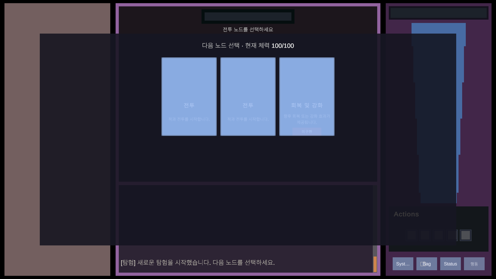
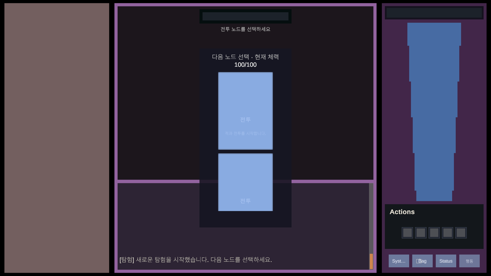

# 점진 생성 탐험 노드 트리

## 책임과 수명

`ExplorationRunState`는 Unity UI에 의존하지 않는 탐험 원본입니다. 가상 Root, 현재 후보 집합, 활성 노드, 마지막 완료 노드, 선택 경로와 모든 선택·미선택 기록을 보존합니다. 후보는 선택한 노드를 완료한 뒤에만 생성되므로 미래 트리를 미리 만들지 않습니다.

`PlayerSessionHost`는 앱 실행 동안 임시 탐험 상태와 진행 중 임시 전투를 보관합니다. 운영 `PlayerState`와 저장 DTO에는 탐험 체력이나 트리를 기록하지 않습니다. 콘텐츠 Scene이 다시 바인딩되면 `ExplorationRunController`는 기존 탐험과 전투를 다시 표시하며 새 후보를 추첨하지 않습니다.

| 타입 | 책임 |
| --- | --- |
| `ExplorationNodeGenerator` | 선택지 수와 종류별 정수 가중치로 후보 종류를 독립 추첨합니다. |
| `ExplorationRunState` | 노드 ID, 부모, 형제 순서, 깊이, 상태, 완료 이유와 탐험 체력을 관리합니다. |
| `ExplorationRunConfiguration` | 기본 선택지 3개와 전투/회복·강화 50/50 가중치를 제공합니다. |
| `ExplorationRunController` | 선택 UI, 처리기 연결, Story 기록, 포커스와 Scene 재바인딩을 담당합니다. |
| `TemporaryDiceRollMenuController` | 전투 노드에서만 행동을 허용하고 탐험의 동일한 `HealthState`를 사용합니다. |

## 상태 전환과 기록

```text
Root(Completed)
└─ Choice Set 1
   ├─ 선택 노드: Available → Active → Completed/Failed
   └─ 형제 노드: Available → Unchosen
      └─ 자식 없음

선택 노드 완료
└─ Choice Set 2를 선택 노드의 자식으로 생성
```

후보 집합 ID가 다른 선택 요청, 활성 Node ID가 다른 완료 요청과 중복 완료는 거부합니다. 미선택 노드는 방문할 수 없으며 실패나 완료로 취급하지 않습니다. 회복·강화 노드는 `PlaceholderAcknowledged`, 전투 승리는 `CombatVictory`, 패배는 `CombatDefeat` 이유를 기록합니다.

예를 들어 세 번 진행하면 선택 경로는 `node-1 → node-4 → node-7`처럼 부모 연결을 유지합니다. 각 선택 집합에서 선택하지 않은 두 형제는 `Unchosen`으로 남으며 자식을 갖지 않습니다.

## 체력과 노드 처리

탐험을 처음 생성할 때 운영 캐릭터의 현재·최대 체력을 새 `HealthState`에 한 번 복사합니다. 모든 전투 노드는 이 인스턴스를 직접 사용하므로 피해와 회복이 다음 노드까지 이어집니다. 회복·강화 미구현 노드는 체력, 스탯과 주사위를 변경하지 않습니다.

전투 노드를 선택하면 임시 적을 생성하고 기존 주사위 전투 규칙을 실행합니다. 승리 시 현재 노드를 완료한 뒤 다음 후보를 생성하고, 패배 시 탐험을 실패 상태로 고정합니다. 선택 대기와 미구현 안내 중에는 `행동` 명령을 실행할 수 없습니다.

## 현재 범위

현재는 전투와 효과 없는 회복·강화 처리기만 등록되어 있습니다. 전체 트리 시각화, 되돌아가기, 최대 깊이, 엔딩, 보상, 실제 강화 효과와 디스크 저장·이어하기는 구현하지 않았습니다.


## 노드 선택 카드

`ExplorationRunController`는 도메인 후보를 표시 데이터로 변환하며, `ExplorationNodeChoiceCardList`는 카드 생성·재사용·포커스와 세로 스크롤을 담당합니다. 선택 요청에는 Run ID, Choice Set ID와 Node ID가 함께 포함되므로 재사용된 이전 카드가 새로운 후보를 선택할 수 없습니다.

카드 Prefab은 `CardRoot > MotionRoot > VisualRoot` 구조를 사용합니다. 부모 Layout은 CardRoot만 배치하며 향후 이동·회전·확대 효과는 MotionRoot에, 외형과 알파 효과는 VisualRoot에 적용합니다. Artwork, Border, FocusVisual과 EffectOverlay는 서로 분리되어 있고 장식 Graphic은 Raycast를 차단하지 않습니다. 현재 기본 표현은 정적이며 실제 Tween, Animator와 셰이더 효과는 구현하지 않았습니다.

`ExplorationNodeChoiceLayoutGroup`은 실제 Viewport 너비를 기준으로 열 수를 계산하고 각 행을 중앙 정렬합니다. 카드 크기를 축소하지 않고 공간이 부족하면 다음 행으로 줄바꿈하며, 높이가 부족하면 외부 ScrollRect가 세로 접근을 제공합니다.

개발자는 `Child Alignment`에서 가로 좌측·중앙·우측과 세로 상단·중앙·하단의 9개 조합을 선택할 수 있습니다. 가로 정렬은 마지막 불완전 행에도 적용되며 데이터 순서는 바뀌지 않습니다. Content의 preferred height는 `max(내용 높이, Viewport 높이)`로 계산됩니다. 따라서 내용이 적을 때에는 세로 정렬 여유가 생기고, 내용이 넘치면 상단부터 배치되어 모든 행에 스크롤로 접근할 수 있습니다. `Padding`은 목록 경계에 한 번만 적용되고 두 Spacing 값은 카드와 행 사이에만 적용됩니다.

카드 외형은 호환용 `Image` 모드와 `Procedural Shape` 모드로 구분됩니다. 절차적 모드에서는 `ShapeVisual`의 `ExplorationCardShapeGraphic`이 사각형, 둥근 사각형, 원, 타원 또는 위쪽을 향한 삼각형 Mesh를 만들고 같은 경계로 Artwork를 마스킹합니다. `ShapeBorder`는 내부 테두리만 그리며 CardRoot의 점유 크기를 늘리지 않습니다. 제목·설명·상태는 ShapeVisual 밖의 형제이므로 도형에 잘리지 않고, CardRoot의 Button 입력 영역은 계속 사각형입니다. 각 Graphic은 공유 Material을 변경하거나 별도 Mesh를 소유하지 않으며 Unity의 VertexHelper 재생성 수명에만 의존합니다.

```text
CardRoot
└─ MotionRoot
   └─ VisualRoot
      ├─ Background (Image 모드 호환 배경)
      ├─ ShapeVisual (도형 Graphic + Mask)
      │  └─ Artwork
      ├─ ShapeBorder
      ├─ Title / Description / StatusBadge
      ├─ FocusVisual
      └─ EffectOverlay
```

| 넓은 부모 영역 | 좁은 부모 영역 |
| --- | --- |
|  |  |
