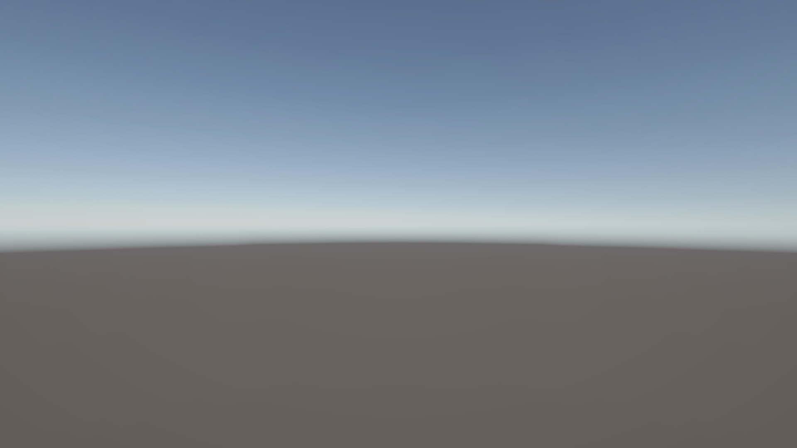
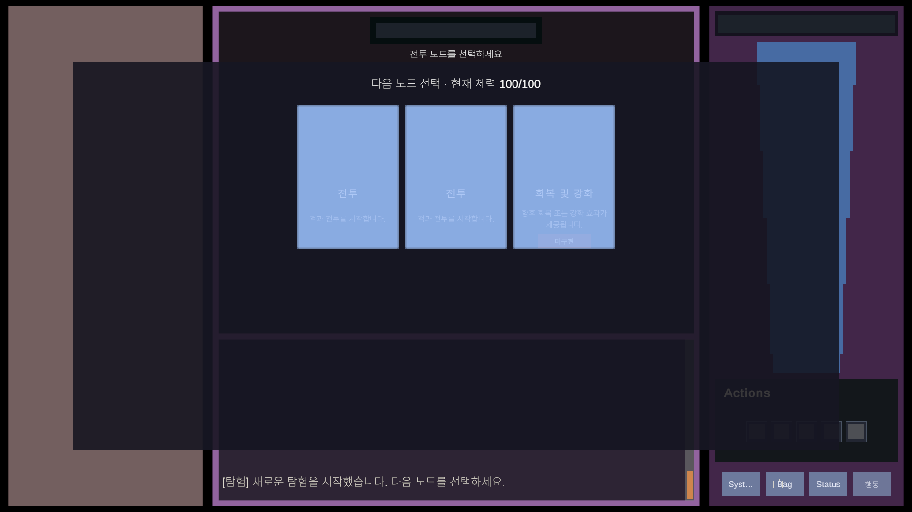
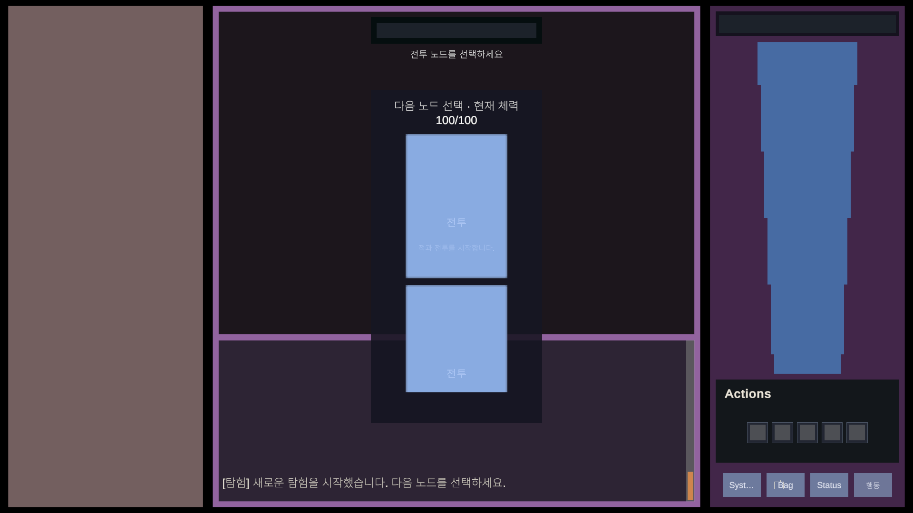

# 점진 생성 탐험 노드 트리

## 책임과 수명

`ExplorationRunState`는 Unity UI에 의존하지 않는 탐험 원본입니다. 가상 Root, 현재 후보 집합, 활성 노드, 마지막 완료 노드, 선택 경로와 모든 선택·미선택 기록을 보존합니다. 후보는 선택한 노드를 완료한 뒤에만 생성되므로 미래 트리를 미리 만들지 않습니다.

`PlayerSessionHost`는 앱 실행 동안 임시 탐험 상태와 진행 중 임시 전투를 보관합니다. 운영 `PlayerState`와 저장 DTO에는 탐험 체력이나 트리를 기록하지 않습니다. 콘텐츠 Scene이 다시 바인딩되면 `ExplorationRunController`는 기존 탐험과 전투를 다시 표시하며 새 후보를 추첨하지 않습니다.

| 타입 | 책임 |
| --- | --- |
| `ExplorationNodeGenerator` | 선택지 수와 종류별 정수 가중치로 후보 종류를 독립 추첨합니다. |
| `ExplorationRunState` | 노드 ID, 부모, 형제 순서, 깊이, 상태, 완료 이유와 탐험 체력을 관리합니다. |
| `ExplorationRunConfiguration` | 기본 선택지 3개와 전투/회복·강화 50/50 가중치를 제공합니다. |
| `ExplorationRunController` | 선택 UI, 처리기 연결, Story 기록, 포커스와 Scene 재바인딩을 담당합니다. |
| `TemporaryDiceRollMenuController` | 전투 노드에서만 행동을 허용하고 탐험의 동일한 `HealthState`를 사용합니다. |

## 상태 전환과 기록

```text
Root(Completed)
└─ Choice Set 1
   ├─ 선택 노드: Available → Active → Completed/Failed
   └─ 형제 노드: Available → Unchosen
      └─ 자식 없음

선택 노드 완료
└─ Choice Set 2를 선택 노드의 자식으로 생성
```

후보 집합 ID가 다른 선택 요청, 활성 Node ID가 다른 완료 요청과 중복 완료는 거부합니다. 미선택 노드는 방문할 수 없으며 실패나 완료로 취급하지 않습니다. 회복·강화 노드는 `PlaceholderAcknowledged`, 전투 승리는 `CombatVictory`, 패배는 `CombatDefeat` 이유를 기록합니다.

예를 들어 세 번 진행하면 선택 경로는 `node-1 → node-4 → node-7`처럼 부모 연결을 유지합니다. 각 선택 집합에서 선택하지 않은 두 형제는 `Unchosen`으로 남으며 자식을 갖지 않습니다.

## 체력과 노드 처리

탐험을 처음 생성할 때 운영 캐릭터의 현재·최대 체력을 새 `HealthState`에 한 번 복사합니다. 모든 전투 노드는 이 인스턴스를 직접 사용하므로 피해와 회복이 다음 노드까지 이어집니다. 회복·강화 미구현 노드는 체력, 스탯과 주사위를 변경하지 않습니다.

전투 노드를 선택하면 임시 적을 생성하고 기존 주사위 전투 규칙을 실행합니다. 승리 시 현재 노드를 완료한 뒤 다음 후보를 생성하고, 패배 시 탐험을 실패 상태로 고정합니다. 선택 대기와 미구현 안내 중에는 `행동` 명령을 실행할 수 없습니다.

## 현재 범위

현재는 전투와 효과 없는 회복·강화 처리기만 등록되어 있습니다. 전체 트리 시각화, 되돌아가기, 최대 깊이, 엔딩, 보상, 실제 강화 효과와 디스크 저장·이어하기는 구현하지 않았습니다.



## 노드 선택 카드

`ExplorationRunController`는 도메인 후보를 표시 데이터로 변환하며, `ExplorationNodeChoiceCardList`는 카드 생성·재사용·포커스와 세로 스크롤을 담당합니다. 선택 요청에는 Run ID, Choice Set ID와 Node ID가 함께 포함되므로 재사용된 이전 카드가 새로운 후보를 선택할 수 없습니다.

카드 Prefab은 `CardRoot > MotionRoot > VisualRoot` 구조를 사용합니다. 부모 Layout은 CardRoot만 배치하며 확대 효과는 MotionRoot에, 외형과 알파 효과는 VisualRoot에 적용합니다. Artwork, Border, FocusVisual과 EffectOverlay는 서로 분리되어 있고 장식 Graphic은 Raycast를 차단하지 않습니다. 피드백 제어기가 unscaled time 기반 확대를 소유하며 별도 Tween 패키지나 Animator는 사용하지 않습니다.

`ExplorationNodeChoiceLayoutGroup`은 실제 Viewport 너비를 기준으로 열 수를 계산하고 각 행을 중앙 정렬합니다. 카드 크기를 축소하지 않고 공간이 부족하면 다음 행으로 줄바꿈하며, 높이가 부족하면 외부 ScrollRect가 세로 접근을 제공합니다.

개발자는 `Child Alignment`에서 가로 좌측·중앙·우측과 세로 상단·중앙·하단의 9개 조합을 선택할 수 있습니다. 가로 정렬은 마지막 불완전 행에도 적용되며 데이터 순서는 바뀌지 않습니다. Content의 preferred height는 `max(내용 높이, Viewport 높이)`로 계산됩니다. 따라서 내용이 적을 때에는 세로 정렬 여유가 생기고, 내용이 넘치면 상단부터 배치되어 모든 행에 스크롤로 접근할 수 있습니다. `Padding`은 목록 경계에 한 번만 적용되고 두 Spacing 값은 카드와 행 사이에만 적용됩니다.

카드 외형은 호환용 `Image` 모드와 `Procedural Shape` 모드로 구분됩니다. 절차적 모드에서는 `ShapeVisual`의 `ExplorationCardShapeGraphic`이 사각형, 둥근 사각형, 원, 타원 또는 위쪽을 향한 삼각형 Mesh를 만들고 같은 경계로 Artwork를 마스킹합니다. `ShapeBorder`는 내부 테두리만 그리며 CardRoot의 점유 크기를 늘리지 않습니다. 제목·설명·상태는 ShapeVisual 밖의 형제이므로 도형에 잘리지 않고, CardRoot의 Button 입력 영역은 계속 사각형입니다. 각 Graphic은 공유 Material을 변경하거나 별도 Mesh를 소유하지 않으며 Unity의 VertexHelper 재생성 수명에만 의존합니다.

```text
CardRoot
└─ MotionRoot
   └─ VisualRoot
      ├─ Background (Image 모드 호환 배경)
      ├─ ShapeVisual (도형 Graphic + Mask)
      │  └─ Artwork
      ├─ ShapeBorder
      ├─ TextBackdrop (두 외형 모드에서 유지되는 불투명 텍스트 배경)
      ├─ Title / Description / StatusBadge
      ├─ FocusVisual
      └─ EffectOverlay
```

| 넓은 부모 영역 | 좁은 부모 영역 |
| --- | --- |
|  |  |

## 카드 입력 피드백과 텍스트 효과

`ExplorationCardDefaultPresentation.asset`은 카드 입력 색상·배율·전환 시간, 제목·설명·상태 색상과 선택적인 TMP 효과를 보유하는 읽기 전용 원본입니다. 카드별 런타임 상태는 `ExplorationCardFeedbackController`와 `ExplorationCardTextEffectController`가 소유하며 공유 프로필 자산을 변경하지 않습니다. 기본 텍스트 색상은 제목 `#F3F6FA`, 설명 `#D3DCE8`, 상태 `#FFF1CF`이고, 일렁임과 움직이는 그라데이션은 세 역할 모두 기본적으로 꺼져 있습니다.

`ExplorationNodeChoiceCardList`는 클릭 또는 Submit을 받으면 목록 전체를 먼저 잠그고 선택 카드의 확정 연출을 unscaled time으로 기다립니다. 표시 세대가 바뀌거나 목록이 숨겨지면 이전 Coroutine을 취소하며, 살아 있는 요청만 기존 `ExplorationRunController` 선택 경로로 한 번 전달합니다. 효과가 꺼졌거나 움직임 줄이기가 활성화되면 공간 애니메이션과 확정 대기를 생략하지만 ID 검증과 입력 잠금은 유지합니다.

TMP 효과는 문자열을 변경하지 않고 원본 Mesh 정점과 색상 사본에서 계산합니다. `OnPreRenderText`가 새 메시를 생성할 때만 캐시를 갱신합니다. 문자열·속성·submesh 배열 길이가 달라지면 오래된 캐시는 폐기하고 TMP의 다음 정상 재생성을 사용합니다. Disable, 재바인딩과 효과 해제 시 유효한 원본만 복원합니다. 프로필이 없으면 불투명 흰색과 정적 표시를 사용합니다. 매 프레임 ForceMeshUpdate는 호출하지 않습니다.

## 가독성과 느린 박동

실행 화면에서 기존 Border의 Image와 Outline이 카드 면 전체를 겹쳐 그리며 글자를 덮는 현상을 재현했습니다. 투명 Image에 `useGraphicAlpha=false`를 지정하는 방식도 Outline이 복제하는 사각 면을 제거하지 못합니다. 저장된 Border와 FocusVisual은 이제 `ExplorationCardShapeGraphic.InnerBorder`를 사용하며, 텍스트 위의 면을 그리지 않습니다. TextBackdrop은 이미지·절차적 도형 모드 모두 `(.105, .14, .21, 1)`을 사용하고 배지는 `(.28, .16, .06, 1)`을 사용합니다. 임의 Artwork와 도형 색상이 필수 문구의 배경을 바꾸지 않습니다. 세 역할의 기존 글자색과 한국어 fallback은 유지합니다.

프로필의 Pulse Enabled, Pulse Min Scale, Pulse Max Scale, Pulse Period 기본값은 활성·1.00·1.03·1.8초입니다. 코사인 곡선으로 절대 배율을 계산하며 Highlighted Scale을 다시 곱하지 않습니다. 역전 범위는 정렬하고 비정상 배율은 1, 비정상 주기는 정적 1로 처리합니다. 상태 진입·이탈은 현재 크기에서 보간하며, 눌림·확정·비활성 상태가 반복 효과보다 우선합니다. Button이나 CanvasGroup의 외부 잠금도 반영합니다.

포인터와 포커스는 별도 상태입니다. 현재 EventSystem의 InputSystemUIInputModule에 연결된 Point·Click·Move·Submit으로 입력 출처를 구분합니다. 터치 선택은 정적 포커스만 남기고 지속 박동을 시작하지 않습니다. ScrollRect가 소유한 드래그를 가로채지 않고 PointerEventData.dragging을 확인하여 눌림과 호버를 해제합니다. 효과 끄기·움직임 줄이기는 입력 상태를 보존하면서 즉시 기본 크기로 복원합니다. Hide·Disable·Unbind는 선택 세대와 효과 위상을 무효화합니다. 플레이어 저장 형식과 기존 두 PlayerPrefs 키는 바뀌지 않습니다.

피드백 tint는 CanvasRenderer에 적용하므로 개발자가 지정한 Graphic 색상과 런타임 도형 색상을 덮어쓰지 않습니다. 배경·장식에만 적용하고 텍스트 배경·글자·배지에는 적용하지 않으므로 비활성 상태에서도 필수 문구의 대비를 유지합니다.

### 2026-09-27 검증 기록

AppScene에서 TMP_MainScene에 진입한 1920×1080 Game View를 캡처했습니다. 수정 전에는 카드 면을 겹쳐 그리는 장식으로 문구가 가려졌고, 수정 후 제목·설명·배지의 CanvasGroup 알파와 Face Color 알파는 모두 1, 정상 문구의 overflow는 false, 한국어 fallback을 포함한 materialCount는 2였습니다. 글리프 누락을 이번 현상의 원인으로 확인하지는 않았습니다.

대비는 sRGB 채널을 선형화한 상대 휘도 `(L밝음 + .05) / (L어두움 + .05)`로 계산했습니다. 기본 불투명 팔레트의 제목/설명/배지 대비는 약 14.33/11.22/11.77:1입니다. 실제 `Assets/Screenshots/exploration-readability-after.png`에서 글자 내부의 가장 밝은 픽셀과 인접한 평탄 배경을 표본 추출하면 각각 14.57/9.22/9.89:1입니다. 안티앨리어싱 가장자리를 글자 원색으로 취급하지 않았으며, 이 수치는 해당 캡처의 표본 결과이지 임의 프로필·디스플레이에 대한 보장은 아닙니다.

Edit Mode 카드 테스트는 24/24 통과했습니다. Play Mode Test Runner는 Domain Reload 뒤 작업 복구 실패로 0개 실행되어 성공으로 기록하지 않았습니다. 대신 같은 Play Mode 테스트 IEnumerator를 실행 중 Editor의 프레임에 맞추어 진행하여 3주기 박동 범위, timeScale=0, 포커스 유지, 설정 변경, 외부 입력 잠금, 터치·드래그 이벤트, 한글/영문/숫자 메시 교체, 효과 해제와 재사용 검증을 통과했습니다. 실제 버튼 onClick 경로로 미구현 노드를 선택하고 계속한 뒤 새 후보와 Story 기록을 확인했습니다. 280px 카드 컨테이너에서는 한 열 줄바꿈과 세로 스크롤 콘텐츠를 확인했습니다.

실제 컨트롤러·터치 기기의 물리 입력, 모바일 safe area·회전·울트라와이드, 확대 접근성 글자, Player/IL2CPP 빌드 및 성능 측정은 수행하지 않았습니다. 입력 이벤트 시뮬레이션과 좁은 컨테이너 검증을 실제 기기 검증으로 간주하지 않습니다.
