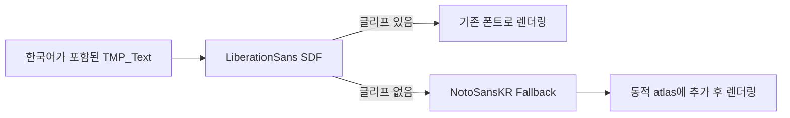

# 한국어 TMP 대체 폰트

## 현재 구성

프로젝트의 TextMeshPro 기본 폰트는 기존 `LiberationSans SDF`를 유지합니다. 영문과 숫자는 기존 머티리얼 및 시각 설정으로 표시하고, 기본 폰트에 글리프가 없을 때만 전역 fallback인 `NotoSansKR Fallback`을 사용합니다.

| 항목 | 경로 또는 값 |
| --- | --- |
| 공식 원본 폰트 | `Assets/TxTRPG/UI/Fonts/Korean/NotoSansKR-Variable.ttf` |
| 라이선스 | `Assets/TxTRPG/UI/Fonts/Korean/OFL.txt` |
| 원본 메타데이터 | `Assets/TxTRPG/UI/Fonts/Korean/METADATA.pb` |
| TMP fallback | `Assets/TxTRPG/UI/Fonts/Korean/NotoSansKR-Fallback.asset` |
| 전역 설정 | `Assets/TextMesh Pro/Resources/TMP Settings.asset` |

원본은 Google Fonts의 `ofl/notosanskr` 배포본이며 SIL Open Font License 1.1을 함께 보관합니다. TMP fallback은 Dynamic Atlas Population Mode, 1024×1024 atlas, 9px padding, SDFAA, Multi Atlas 활성화 설정을 사용합니다. 소스 폰트는 TMP Settings에서 참조하는 fallback asset을 통해 Player에 포함됩니다.

## 원인과 표시 흐름

실행 중 사용한 한국어 문자열은 올바르게 저장되어 있었습니다. 그러나 기존 `LiberationSans SDF`에는 한국어 글리프가 없고 `TMP Settings`의 전역 fallback 목록도 비어 있었으므로, TextMeshPro가 해당 문자를 표시할 수 없었습니다.

이 구성은 각 Scene과 Prefab의 `font` 참조나 폰트 머티리얼을 일괄 교체하지 않습니다. 따라서 기존 영문 외형과 사용자 Prefab override를 보존합니다. fallback 글리프는 필요할 때 atlas에 추가되므로, 최초 사용 시 atlas 생성 비용과 메모리 증가가 발생할 수 있습니다. 실제 대상 기기에서 메모리와 프레임 시간을 측정한 뒤 정적 atlas 또는 문자 집합 분할이 필요할지 판단해야 합니다.

## 적용과 업그레이드

`Tools > TxT RPG > UI > Fonts > Apply Korean Font Fallback`은 다음 작업만 수행합니다.

1. 공식 원본 TTF에서 fallback asset이 없을 때만 생성합니다.
2. 기존 fallback asset에는 Dynamic 및 Multi Atlas 정책을 다시 적용합니다.
3. `TMP Settings`의 기존 fallback 순서를 보존하면서 Noto Sans KR이 없을 때만 끝에 추가합니다.
4. 기본 폰트와 Scene, Prefab, 사용자 저장 데이터는 변경하지 않습니다.

메뉴는 안전하게 반복 실행할 수 있습니다. 이미 등록된 fallback을 중복 추가하지 않습니다. 기존 자산을 업그레이드할 때에는 컴파일이 끝난 뒤 메뉴를 한 번 실행하고, `TMP Settings > Fallback Font Assets`에서 `NotoSansKR Fallback`이 등록되었는지 확인합니다.

## 검증 범위

`KoreanFontFallbackTests`는 기본 영문 폰트 보존, 전역 fallback 등록, 동적·다중 atlas 설정과 다음 대표 문자열의 글리프 추가 가능 여부를 확인합니다.

- `주사위 결과: D6 → 5`
- `가방 · 설정`
- `가나다라마바사`
- `ㄱㄴㄷ ㅏㅑㅓ`

이 검증은 프로젝트에서 현재 사용하는 대표 한국어 범위를 확인합니다. 모든 한자, 일본어, 이모지와 미래 현지화 문자열 전체를 지원한다는 의미는 아닙니다.
