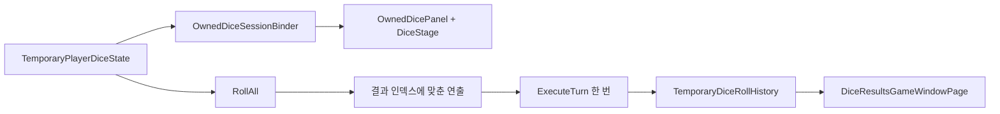

# 보유 주사위 3D 표시와 결과 기록

`TMP_MainScene`의 `ExplorationAndDicePanel`은 기존 `NodeTreePanel`과 `OwnedDicePanel`을 세로로 배치합니다. 넓은 화면에서는 내부 항목의 가중치가 2:1이며, 좁은 화면에서는 부모의 최소 높이와 `ResponsiveMainScreen`의 전체 페이지 스크롤을 사용합니다. 탐험 트리 오브젝트와 `ExplorationRunController.treePanel` 참조는 유지됩니다.

| 책임 | 구현 |
| --- | --- |
| 보유 목록 | `TemporaryPlayerDiceState`가 인스턴스 ID, 정의 ID, 면 구성을 복사해 보관하고 변경을 알립니다. |
| 판정과 전투 | `TemporaryDiceRollMenuController`가 `RollAll`을 한 번 호출하고 연출 후 기존 `TemporaryCombatState.ExecuteTurn`을 한 번 호출합니다. |
| 행동 잠금·결과 수명 | `PlayerSessionHost`가 수락된 행동 ID와 전투·Story 완료 알림, 결과 창 요청을 Scene 교체 중에도 유지합니다. |
| 3D 표시 | `OwnedDiceSessionBinder`가 보유 스냅샷을 UI 데이터로 변환합니다. `OwnedDicePanel`은 독립 `DiceStage`의 Camera 출력을 크기 제한 RenderTexture로 받습니다. |
| 기록·창 | `TemporaryDiceRollHistory`가 전투 노드별 스냅샷을 보관합니다. `DiceResultsGameWindowPage`는 기존 `GameWindowService`와 `ModalWindowHost`에 등록됩니다. |

기본 형태는 `Assets/TxTRPG/UI/Prefabs/Dice/DiceD4.prefab`, `DiceD6.prefab`, `DiceD8.prefab`과 `Assets/TxTRPG/UI/Styles/Dice/DieShapeCatalog.asset`입니다. `DieShapeDefinition`은 정의 ID, 모델 Prefab, 면 인덱스별 최종 자세와 읽기 규칙을 지정합니다. 모델의 `DieModelView`가 면별 공격·회복 약호와 수치를 표시합니다. D4는 카메라를 향한 삼각형 면, D6·D8은 위쪽이면서 카메라에서 보이는 면을 읽습니다. 표시가 작을 때에는 결과 창에서 전체 효과와 수치를 읽을 수 있습니다.

행동을 수락하면 참여 주사위와 `RunId`·`NodeId`·전투 참조를 고정합니다. 연출 실패나 타임아웃에는 확정 결과를 텍스트로 대체한 뒤 같은 결과를 적용합니다. 새 세션이나 전투로 바뀐 오래된 작업은 적용하지 않습니다. 화면이 교체되어도 같은 세션의 전투 완료와 Story·결과 요청은 새 바인딩으로 전달됩니다. 기록과 자동 결과 표시 여부는 세션 수명이며 저장 파일에는 기록하지 않습니다.

기본 기록 모드는 `LatestCombatNode`이고 새 전투에 진입하면 그 전투의 기록으로 전환합니다. `RecentSessionCombats`와 보관 전투 수는 `TemporaryDiceRollMenuController`의 Inspector에서 선택합니다. 자동 결과 표시 기본값은 켜짐이며 `PlayerSessionHost.TemporaryDicePreferences.AutoShowResults`에서 런타임 변경할 수 있습니다. `ReduceMotion`도 같은 설정 경계에 있습니다. 결과 창은 확인 또는 공통 모달의 바깥 클릭·탭으로 닫고, 닫을 때 기존 포커스를 복원합니다. 결과 보기 버튼은 주사위가 0개여도 빈 기록 상태를 보여줍니다.

영구 저장, 획득·제거 화면, 인게임 옵션 화면, 물리 기반 판정은 이 구현에 포함되지 않습니다. 자산 생성·교체, Scene 적용과 검증 경로는 [개발 절차](../development/workflows.md#보유-주사위-3d-패널과-결과-기록)를 참고합니다.
