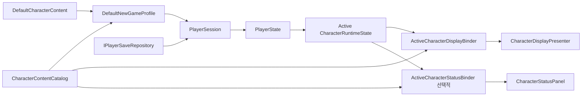

# PlayerSession과 새 게임 초기화

## 책임과 수명

`TxTRPG.Application`은 콘텐츠 정의와 Gameplay 상태를 실제 게임 실행에 연결합니다. `PlayerSessionHost`는 항상 유지되는 `AppScene`의 `AppRoot.prefab`에 배치되며, 콘텐츠 Scene의 UI는 이 Host가 소유한 `PlayerSession`만 참조합니다. 운영 UI가 `DefaultCharacterContent`를 직접 읽어 플레이어 상태를 만드는 방식은 사용하지 않습니다.

| 형식 | 책임 |
| --- | --- |
| `NewGameProfile` | 새 게임에 사용할 `CharacterContentCatalog`와 최초 `CharacterContentDefinition`을 명시하고 연결 무결성을 검사합니다. |
| `PlayerSession` | 저장 데이터가 있으면 복원하고, 없으면 Profile의 최초 캐릭터로 `PlayerState`를 생성합니다. |
| `IPlayerSaveRepository` | 저장 매체를 추상화합니다. 현재 기본 구현은 로컬 JSON 파일을 사용합니다. |
| `PlayerSessionHost` | AppScene 수명 동안 Session을 한 번 소유하고 초기화 및 저장 진입점을 제공합니다. |
| `ActiveCharacterDisplayBinder` | 활성 캐릭터의 외형만 Presenter에 반영하고, Addressables 표시 자산 준비를 Scene 준비 계약에 포함합니다. |
| `ActiveCharacterStatusBinder` | 선택적으로 배치된 상태 컨테이너에 이름과 Health 표시 모델을 전달합니다. 상태 UI가 없으면 배치하지 않습니다. |

## 시작과 복구 정책

1. `PlayerSessionHost`가 `Assets/TxTRPG/Application/Configuration/DefaultNewGameProfile.asset`을 검증합니다.
2. `LocalPlayerSaveRepository`가 `Application.persistentDataPath/player-save.json`을 읽습니다.
3. 파일이 없으면 `character.default`의 독립적인 런타임 상태를 생성하고 주입된 `ICharacterInstanceIdGenerator`로 Instance ID를 발급합니다.
4. 파일이 있으면 `PlayerFactory`가 카탈로그의 Gameplay Definition을 기준으로 전체 `PlayerState`를 복원합니다. 이때 새 Instance ID는 발급하지 않습니다.
5. 콘텐츠 Scene의 `ActiveCharacterDisplayBinder`가 준비된 Session의 활성 캐릭터를 표시합니다. Presenter의 Addressables 요청과 레이아웃 확정이 끝나야 `ISceneReadySource.WhenReady`가 완료됩니다.

손상되었거나 지원하지 않는 저장 데이터는 새 게임으로 조용히 대체하지 않습니다. 초기화를 실패시키고 원본 파일을 보존하여 진단과 명시적인 복구가 가능하게 합니다. 저장할 때에는 같은 디렉터리의 임시 파일을 먼저 쓴 뒤 대상 파일로 교체하며, 기존 파일이 있으면 `.bak` 백업을 유지합니다.

## 표시와 현지화 경계

`TMP_MainScene`의 운영용 캐릭터 패널에는 Demo Loader와 상태 UI가 없습니다. `ActiveCharacterDisplayBinder`가 `PlayerState.ActiveCharacter`와 `CharacterContentCatalog`를 조합하여 `CharacterDisplayPresenter`에 전달합니다. 상태 표시가 필요한 다른 화면에서는 `ActiveCharacterStatusBinder`와 조합형 `CharacterStatusPanel`을 별도로 배치합니다.

캐릭터 이름은 `ICharacterNameLocalizer`로 이미 현지화된 값만 표시합니다. Health Label과 값 형식은 `IHealthTextFormatter`가 결정합니다. 서비스가 연결되지 않은 동안에는 localization key를 사용자에게 노출하지 않고 이름과 Label 영역을 숨기며, Health 값은 현재 문화권의 숫자 형식으로 표시합니다.

## 확장 경계

현재 `LocalPlayerSaveRepository`는 공통 로컬 파일 저장 구현입니다. Steam Cloud, 모바일 Cloud Save, 슬롯 선택 또는 사용자별 저장소를 추가할 때에는 `IPlayerSaveRepository` 구현과 Application 조립 코드만 교체하고, Gameplay의 `PlayerState`와 UI Binder는 유지합니다. 저장 형식의 버전 변경은 Gameplay DTO의 명시적인 마이그레이션과 함께 수행해야 합니다.
