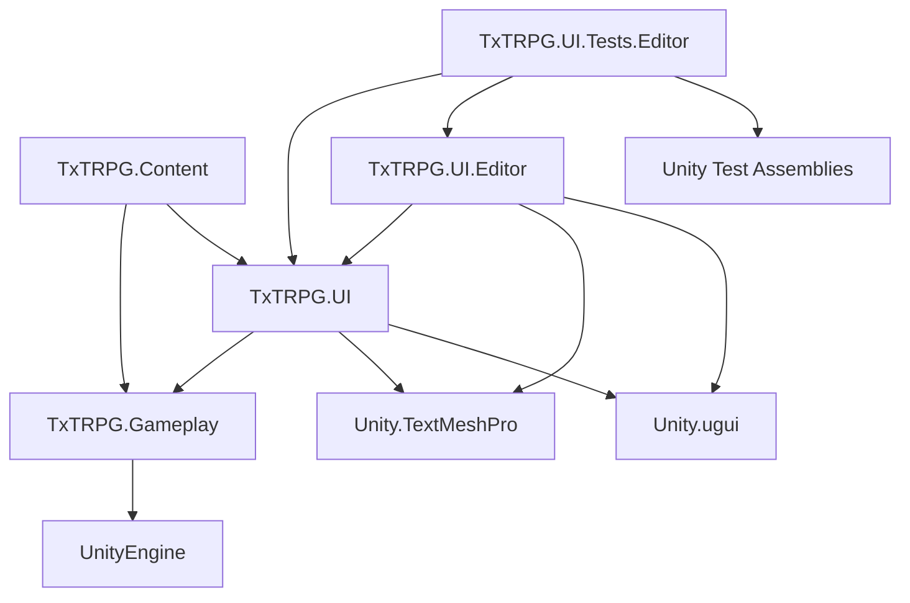

# 프로젝트 구조

## 기술 기반

| 항목 | 현재 값 또는 역할 |
| --- | --- |
| Unity | `6000.3.22f1` |
| 렌더 파이프라인 | Universal Render Pipeline 17.3.0 |
| 입력 | Unity Input System 1.20.0 |
| UI | uGUI와 TextMeshPro |
| 테스트 | Unity Test Framework 1.6.0 |
| 기본 빌드 씬 | `Assets/Scenes/AppScene.unity` |

`StoryTextPanel`은 특정 씬에 직접 연결되어 있지 않습니다. 필요한 씬의 Canvas 아래에 프리팹을 배치하여 사용합니다.

## 주요 디렉터리

```text
TxT-RPG/
├── AGENTS.md
├── DOCS/
│   ├── README.md
│   ├── architecture/
│   │   ├── project-structure.md
│   │   ├── story-text-panel.md
│   │   ├── character-display-panel.md
│   │   ├── enemy-display-panel.md
│   │   ├── action-grid-panel.md
│   │   ├── flexible-layout-panel.md
│   │   ├── scene-transition.md
│   │   ├── character-content.md
│   │   └── asset-management.md
│   └── development/
│       └── workflows.md
├── Assets/
│   ├── Scenes/
│   │   ├── AppScene.unity
│   │   └── TMP_MainScene.unity
│   ├── TextMesh Pro/
│   │   └── Resources, Fonts, Shaders, Sprites
│   └── TxTRPG/
│       ├── Gameplay/
│       │   ├── Runtime/Characters/
│       │   └── Tests/Editor/
│       ├── Content/
│       │   ├── Runtime/Characters/
│       │   ├── Editor/
│       │   └── Tests/Editor/
│       ├── SceneTransition/
│       │   ├── Runtime/
│       │   ├── Editor/
│       │   ├── Profiles/
│       │   ├── Prefabs/
│       │   ├── Resources/TxTRPG/       레거시 호환 자산
│       │   └── Tests/Editor/
│       └── UI/
│           ├── Runtime/
│           ├── Editor/
│           ├── Prefabs/
│           ├── Styles/
│           ├── DEMO/
│           └── Tests/Editor/
├── Packages/
└── ProjectSettings/
```

### `Assets/TxTRPG/SceneTransition`

`TxTRPG.SceneTransition`은 UI Panel과 독립적으로 `AppScene` 및 Additive Content Scene 교체 흐름을 담당합니다. Runtime 어셈블리는 `AppSceneRoot`, `ScenePathAttribute`, `ISceneInitializer`, `ISceneReadySource`, `ISceneLoader`, `IScreenTransitionEffect`와 기본 Fade를 포함합니다. Editor 어셈블리는 기본 Profile, `AppRoot.prefab`, `AppScene.unity`와 Build Settings를 재현 가능하게 생성하고, Build Settings 기반 Scene 경로 선택기와 빌드 전 검증을 제공합니다. Tests 어셈블리는 AppScene 구조, Scene 경로 정책, Additive 로드, 초기화 순서, 중복 요청과 실패·취소 복구를 검증합니다.

### `Assets/TxTRPG/Gameplay`

`TxTRPG.Gameplay`은 UI와 Scene 수명에서 독립된 게임 규칙 어셈블리입니다. `Runtime/Characters`에는 안정적인 Stat ID, 기본 스탯 Definition, 캐릭터 인스턴스 상태, 체력, 피해 계산 계약과 버전 저장 DTO가 있습니다. `Runtime/Players`에는 플레이어가 소유한 캐릭터 목록, 활성 캐릭터 선택, 복수 캐릭터 저장 DTO와 기존 단일 캐릭터 저장 변환 기능이 있습니다. `Tests/Editor`는 기본값 검증, 피해·회복 경계, 플레이어 불변 조건, 저장 Round Trip과 마이그레이션을 검증합니다. UI의 `CharacterPresentation`은 이 어셈블리로 이동하지 않으며 계속 외형 표현만 담당합니다.

### `Assets/TxTRPG/Content`

`TxTRPG.Content`는 Gameplay의 `CharacterDefinition`과 UI의 `CharacterAppearanceDefinition`을 `CharacterContentDefinition`으로 조합하는 콘텐츠 계층입니다. `CharacterContentCatalog`는 로드된 가벼운 정의를 안정적인 Definition ID로 조회하며, `TxTRPG.Content.Editor`는 `Tools > TxT RPG > Validate Character Content`에서 누락 참조, ID 불일치, 기본 Addressable artwork ID와 프로젝트 전체 중복 ID를 검사합니다. 고해상도 Sprite는 Content 에셋이 직접 소유하지 않고 기존 `Character2DView`가 ID로 지연 로드합니다.

### `Assets/TxTRPG/UI/Runtime`

플레이어 빌드에 포함되는 UI 모델과 MonoBehaviour가 있습니다. Editor API를 직접 사용하지 않습니다.

| 파일 | 역할 |
| --- | --- |
| `StoryMessage.cs` | 표시가 준비된 본문과 선택적 발화자를 전달하는 불변 값 객체입니다. |
| `StoryMessageItem.cs` | 메시지 하나를 TextMeshPro UI에 바인딩하고 항목 전체의 투명도를 제어합니다. |
| `StoryTextPanel.cs` | 메시지 생성·보관, 하단 정렬, 스크롤 동기화, 위치별 투명도 계산을 담당합니다. |
| `StoryTextPanelDemoData.cs` | Editor와 런타임 데모가 공유하는 메시지 목록 ScriptableObject입니다. |
| `StoryTextPanelDemoLoader.cs` | Play Mode 시작 시 데모 데이터를 실제 패널 메시지로 추가합니다. |
| `StoryTextPanelDemoPreviewItem.cs` | Edit Mode 전용 미리보기 항목을 표시하고 Play Mode에서 해당 오브젝트를 제거합니다. |
| `CharacterPresentation.cs` | Unity 자산 참조 없이 캐릭터 표시 상태를 전달하는 불변 값 객체입니다. |
| `Characters/CharacterPresentationFactory.cs` | Gameplay 캐릭터 상태와 요청한 외형 ID를 UI용 `CharacterPresentation`으로 변환합니다. |
| `ICharacterView.cs` | 2D와 향후 3D View의 최소 공통 API를 정의합니다. |
| `CharacterViewBase.cs` | View의 표시 상태와 등장·퇴장 페이드를 관리합니다. |
| `CharacterDisplayPanel.cs` | 활성 캐릭터 View의 표시, 교체, 숨김과 초기화를 조율합니다. |
| `Character2DView.cs` | 외형 Sprite, Overlay, 좌우 반전과 2D 애니메이션을 처리합니다. |
| `CharacterAppearanceDefinition.cs` | 캐릭터별 ID 조합과 Sprite를 연결하는 ScriptableObject입니다. |
| `CharacterEffectPlayer.cs` | 선택적인 Animator 기반 캐릭터 효과를 재생합니다. |
| `CharacterDisplayPanelDemoData.cs` | 데모 외형 정의와 ID 기반 표시 요청을 보관합니다. |
| `CharacterDisplayPanelDemoLoader.cs` | Play Mode에서 데모 캐릭터와 등장 전환을 실행합니다. |
| `EnemyPresentation.cs` | 적 종류와 개별 전투 인스턴스를 분리하여 전달하는 불변 값 객체입니다. |
| `EnemyDisplayPanel.cs` | 다중 적 목록, 단일 타깃 정책과 교체 가능한 표시 Backend를 조율합니다. |
| `Enemy2DDisplayBackend.cs` | 개별 적 View 풀과 반응형 포메이션을 관리합니다. |
| `Enemy2DView.cs` | 적 Sprite, 프레이밍, 타깃·패배 상태와 의미 기반 연출을 표시합니다. |
| `EnemyAppearanceDefinition.cs` | 적 ID 조합과 Addressables Sprite를 연결하는 ScriptableObject입니다. |
| `EnemyLayoutStrategyBase.cs` | 적 배치 전략의 교체 가능한 계산 계약을 제공합니다. |
| `ResponsiveHorizontalEnemyLayoutStrategy.cs` | 행별 중앙 정렬과 화면 크기에 따른 축소·개행을 계산합니다. |
| `EnemyDisplayPanelDemoData.cs` | 같은 적 종류의 서로 다른 인스턴스를 포함하는 Demo 데이터를 보관합니다. |
| `EnemyDisplayPanelDemoLoader.cs` | Demo 적 자산을 준비하고 목록을 적용합니다. |
| `ActionGridModels.cs` | 공통 항목, 메뉴 옵션, 결과와 외부 Provider·Executor 경계를 정의합니다. |
| `ActionGridCell.cs` | 아이콘, 수량, 쿨다운, 비활성, 선택과 빈 슬롯 상태를 표시합니다. |
| `ActionGridPanel.cs` | 셀 풀, 반응형 레이아웃, 선택, Navigation과 명령 실행 흐름을 관리합니다. |
| `ConfigurableScrollbarController.cs` | ScrollRect와 스크롤바 동기화, 가시성, 공간과 핸들 크기 정책 및 대칭 OppositeScrollbarArea를 관리합니다. |
| `ScrollbarStyle.cs` | 여러 UI에서 재사용할 스크롤바 Sprite, Color와 Material을 정의합니다. |
| `ActionContextMenu.cs` | 외부에서 제공된 명령 옵션 Button을 풀링하고 포커스를 복원합니다. |
| `ActionGridPanelDemoData.cs` | 아이템과 스킬이 혼합된 데모 표시 데이터를 보관합니다. |
| `ActionGridPanelDemoController.cs` | Play Mode 데모의 옵션 제공자와 명령 실행기 예제를 제공합니다. |
| `FlexibleLayoutItem.cs` | 자식 영역의 가중치·고정 크기와 최소·최대 크기를 정의합니다. |
| `FlexibleLayoutPanel.cs` | 레이아웃 컨테이너의 외부 API, 직렬화 설정과 ContentLayer 참조를 관리합니다. |
| `FlexibleContentLayoutGroup.cs` | ContentLayer의 실제 크기를 기준으로 직계 자식의 반응형 배치를 담당합니다. |
| `FlexibleLayoutBackground.cs` | 배경 슬롯, 효과 Overlay, 클리핑, 머티리얼 소유권과 교차 페이드를 관리합니다. |
| `FlexibleLayoutBackgroundStyle.cs` | 재사용 가능한 배경 Sprite·색상·표시·Material 정책을 정의합니다. |
| `PanelBackgroundRenderer.cs` | 여러 UI 패널이 공유하는 배경 교차 페이드와 Addressables 수명 관리를 제공합니다. |
| `PanelBackgroundStyle.cs` | 여러 UI 패널이 공유하는 배경 스타일 기반 형식을 제공합니다. |
| `PanelStartupController.cs` | 패널 초기화 상태, 취소, 레이아웃 확정과 입력 활성화 순서를 관리합니다. |
| `PanelInitialDataLoader.cs` | 패널별 초기 데이터 Loader의 비동기 계약을 제공합니다. |
| `PanelRevealTransition.cs` | 교체 가능한 패널 등장 연출 계약을 제공합니다. |
| `FadePanelRevealTransition.cs` | 첫 프레임을 숨김 상태로 유지하는 기본 Fade 등장 연출입니다. |
| `IAssetProvider.cs` | UI와 Addressables 구현 사이의 비동기 로딩 경계를 정의합니다. |
| `AddressablesAssetProvider.cs` | Addressables Handle을 Lease로 감싸고 실패·취소 시 해제합니다. |
| `AssetLease.cs` | 로드된 에셋과 정확히 한 번 실행되는 해제 책임을 함께 보관합니다. |
| `AssetScope.cs` | 화면 또는 목록 수명에 속한 여러 Lease를 일괄 해제합니다. |
| `TxTRPG.UI.asmdef` | 런타임 UI 어셈블리 경계를 정의합니다. |

### `Assets/TxTRPG/UI/Editor`

프리팹 생성, 데모 생성, Edit Mode 미리보기를 담당합니다. 플레이어 빌드에는 포함되지 않습니다.

| 파일 | 역할 |
| --- | --- |
| `StoryTextPanelPrefabBuilder.cs` | 운영용 `StoryMessageItem`과 `StoryTextPanel` 프리팹을 생성합니다. |
| `StoryTextPanelDemoBuilder.cs` | 기본 데모 데이터와 `StoryTextPanelDemo` 프리팹을 생성합니다. |
| `StoryTextPanelEditModePreview.cs` | 데모 데이터를 미리보기 항목으로 직렬화하고 열린 미리보기의 레이아웃·투명도를 갱신합니다. |
| `CharacterDisplayPanelPrefabBuilder.cs` | 운영용 `CharacterDisplayPanel` 2D Prefab을 생성합니다. |
| `CharacterDisplayPanelDemoBuilder.cs` | 데모 Sprite, 외형 정의, 데이터와 미리보기 Prefab을 생성합니다. |
| `EnemyDisplayPanelPrefabBuilder.cs` | 운영용 다중 적 패널, 2D View Template과 풀 계층을 생성합니다. |
| `EnemyDisplayPanelDemoBuilder.cs` | 샘플 적 Sprite, 외형 정의, 데이터와 Demo Prefab을 생성합니다. |
| `ActionGridPrefabBuilder.cs` | 셀, 컨텍스트 메뉴와 그리드 패널 운영용 Prefab을 생성합니다. |
| `ActionGridPanelDemoBuilder.cs` | 데모 아이콘, 데이터와 Edit Mode 미리보기 Prefab을 생성합니다. |
| `FlexibleLayoutPrefabBuilder.cs` | 빈 운영용 레이아웃 Prefab과 세 제품 UI를 조합한 재귀 Demo를 생성합니다. |
| `AddressableAssetEditor.cs` | 수명 기반 그룹과 안정적인 주소 등록 및 Player Content 빌드 메뉴를 제공합니다. |
| `TxTRPG.UI.Editor.asmdef` | Editor 전용 어셈블리 경계를 정의합니다. |

### `Assets/TxTRPG/UI/Prefabs`

| 자산 | 역할 |
| --- | --- |
| `StoryMessageItem.prefab` | 본문과 선택적 발화자를 표시하는 메시지 항목입니다. |
| `StoryTextPanel.prefab` | 실제 게임 화면에 배치하는 운영용 텍스트 패널입니다. |
| `CharacterDisplayPanel.prefab` | 교체 가능한 2D View를 포함하는 운영용 캐릭터 표시 패널입니다. |
| `EnemyDisplayPanel.prefab` | 풀링되는 2D 적 View와 반응형 포메이션을 포함하는 운영용 적 표시 패널입니다. |
| `ActionGridCell.prefab` | 공통 행동 항목 하나의 표시와 선택 상태를 담당합니다. |
| `ActionContextMenu.prefab` | 선택 항목의 동적 명령 목록을 표시합니다. |
| `ActionGridPanel.prefab` | 아이템과 스킬을 표시하며 Scroll View 아래에 비상호작용 `OppositeScrollbarArea`를 포함하는 반응형 선택 그리드입니다. |
| `FlexibleLayoutPanel.prefab` | Background·Content·Foreground 계층과 빈 ContentLayer를 제공하는 운영용 레이아웃 컨테이너입니다. |

### `Assets/TxTRPG/UI/Styles`

| 자산 | 역할 |
| --- | --- |
| `StoryTextPanelDefaultBackgroundStyle.asset` | StoryTextPanel 운영 Prefab이 별도 설정 없이 표시하는 기본 배경 Tint와 표현 정책입니다. |

### `Assets/TxTRPG/UI/DEMO`

| 자산 | 역할 |
| --- | --- |
| `StoryTextPanelDemoData.asset` | 길이와 발화자 유무가 다른 기본 메시지 16개를 보관합니다. |
| `StoryTextPanelDemo.prefab` | 운영용 패널, 런타임 로더, Edit Mode 미리보기 항목을 조합한 검증용 프리팹입니다. |
| `CharacterDisplayPanel/CharacterDisplayPanelDemo.prefab` | 운영용 캐릭터 패널, 샘플 외형과 런타임 로더를 조합한 검증용 프리팹입니다. |
| `EnemyDisplayPanel/EnemyDisplayPanelDemo.prefab` | 같은 종류의 적 세 인스턴스, 타깃 표시와 런타임 로더를 조합한 검증용 프리팹입니다. |
| `ActionGridPanel/ActionGridPanelDemo.prefab` | 혼합 항목, 셀 상태와 컨텍스트 메뉴를 조합한 검증용 프리팹입니다. |
| `FlexibleLayoutPanel/FlexibleLayoutPanelDemo.prefab` | Story, Action과 Character Demo를 가중치 기반 중첩 레이아웃으로 조합한 검증용 프리팹입니다. |
| `FlexibleLayoutPanel/FlexibleLayoutBackgroundDemoStyle.asset` | Demo 루트의 정적 배경 색상과 클리핑 정책을 정의합니다. |

### `Assets/TxTRPG/UI/Tests/Editor`

투명도 계산, 캐릭터 표시 요청, 운영용 프리팹 참조, 데모 데이터 구성, Edit Mode 미리보기 항목 수와 Flexible Layout의 순수 크기 계산·재귀 Demo 구조를 검증합니다. 테스트 어셈블리는 플레이어 빌드에 포함되지 않습니다.

### `Assets/AddressableAssetsData`

Addressables 프로필, 빌드 스크립트와 `SharedUI`, `Gameplay_Common`, `Character_Demo`, `Enemy_Demo` 그룹 설정을 보관합니다. 이 디렉터리는 재현 가능한 빌드 설정이므로 버전 관리 대상입니다. 생성된 실제 Bundle 출력은 소스 구조로 취급하지 않습니다.

## 어셈블리 의존 관계



의존 방향은 Editor와 테스트에서 런타임으로만 향해야 합니다. `TxTRPG.Gameplay`은 `TxTRPG.UI`와 `TxTRPG.Content`를 참조하지 않습니다. `TxTRPG.UI`는 표시 모델 변환을 위해 Gameplay를 참조하고, `TxTRPG.Content`는 두 런타임 정의를 조합하기 위해 Gameplay와 UI를 참조합니다. 런타임 어셈블리가 Editor 또는 테스트 어셈블리를 참조하면 플레이어 빌드 경계가 훼손됩니다.

## Unity 기본·생성 디렉터리

- `Assets/TextMesh Pro`에는 TextMeshPro 필수 리소스가 있습니다. 실제 다국어 출시에 필요한 글꼴과 fallback 구성은 별도로 추가해야 합니다.
- `Library`, `Temp`, `Logs`, `obj`는 Unity 또는 빌드 도구가 생성합니다. 소스 구현이나 문서의 권위 있는 근거로 사용하지 않으며 직접 수정하지 않습니다.
- `Assets/TutorialInfo`와 `Assets/Readme.asset`은 Unity 템플릿 자산입니다. 현재 제품 런타임 구조에는 참여하지 않습니다.

## 아직 구현되지 않은 주요 영역

다음 영역은 제품 목표에는 포함되지만 현재 구조에는 구현되어 있지 않습니다.

- 스토리 진행 및 선택지 결정 시스템
- 현지화 서비스와 문자열 테이블
- 3D 캐릭터·적 표시와 동적 전투 슬롯
- 플랫폼 저장소, 원자적 파일 교체와 전체 게임 저장 마이그레이션
- Steam 및 모바일 플랫폼 서비스
- 모바일 Safe Area를 포함한 최종 화면 조합과 기기별 레이아웃 검증

새 영역을 구현할 때 런타임, 플랫폼 어댑터, Editor 제작 도구와 테스트의 경계를 먼저 결정해야 합니다.
