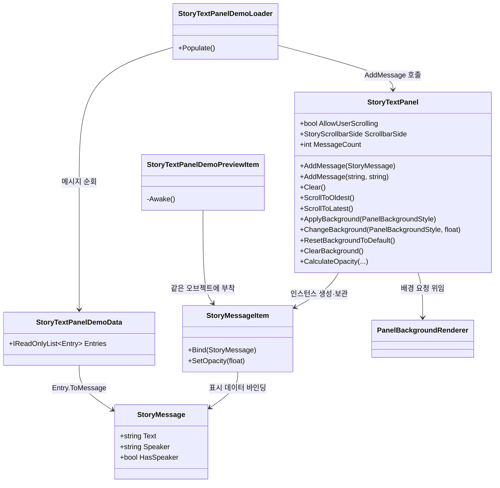
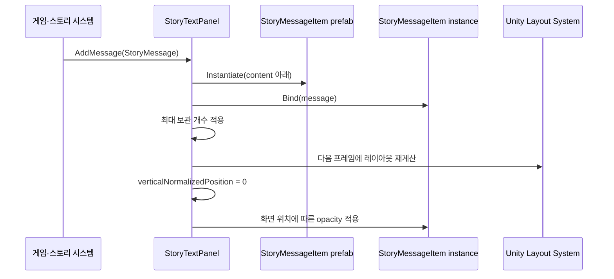
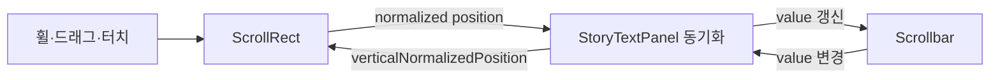

# StoryTextPanel 설계

## 목적

`StoryTextPanel`은 텍스트 RPG의 시간순 메시지 기록을 표시합니다. 최신 메시지는 아래쪽에 배치되고, 화면 위쪽의 오래된 메시지는 설정에 따라 점차 투명해집니다. 사용자 스크롤과 스크롤바 표현은 Inspector에서 선택할 수 있습니다.

배경 표현은 `StoryTextPanel`이 직접 렌더링하지 않습니다. 공통 `PanelBackgroundRenderer`와 `PanelBackgroundStyle`을 조합하며, 패널은 배경 변경 요청만 위임합니다.

이 컴포넌트는 스토리 규칙이나 현지화 키를 해석하지 않습니다. 호출자는 현지화가 완료된 문자열과 발화자를 `StoryMessage`로 전달해야 합니다.

## 초기화와 필수 참조

`StoryTextPanel`에는 `messagePrefab`, `viewport`, `content`, `scrollRect`, `scrollbar` 참조가 필요합니다. `OnEnable()`은 모든 필수 참조가 준비된 경우에만 스크롤 이벤트를 등록합니다. 참조가 누락되면 Editor와 Development Build에서 누락된 필드 이름을 경고하고 초기화를 중단하므로, Prefab 생성 도중이나 불완전한 Scene 인스턴스에서도 `NullReferenceException`이 발생하지 않습니다.

`OnDisable()`은 이벤트가 실제로 등록된 경우에만 안전하게 해제합니다. 운영용 Prefab 생성기는 루트 GameObject를 비활성화한 상태에서 컴포넌트와 직렬화 참조를 구성하고, 모든 참조를 적용한 뒤 활성화하여 저장합니다.

## 런타임 클래스 관계



## 운영용 프리팹 계층

```text
StoryTextPanel
├── BackgroundLayer         PanelBackgroundRenderer
│   └── BackgroundViewport  RectMask2D
│       └── BackgroundVisualRoot
│           ├── BackgroundA
│           ├── BackgroundB
│           └── BackgroundEffectOverlay
├── Viewport                 RectMask2D
│   └── Content              VerticalLayoutGroup, ContentSizeFitter
│       └── StoryMessageItem 런타임에 순서대로 생성됨
├── Scrollbar
    └── Sliding Area
        └── Handle
├── ForegroundEffectLayer
└── TransitionOverlay
```

`StoryTextPanel` 루트에는 `ScrollRect`와 `StoryTextPanel` 컴포넌트가 있습니다. 이전 Root `Image`의 정적 배경 책임은 제거했습니다. 포인터 입력은 투명한 Viewport Image가 수신하며, 실제 배경은 `PanelBackgroundRenderer`만 표시합니다.

운영 Prefab은 `Assets/TxTRPG/UI/Styles/StoryTextPanelDefaultBackgroundStyle.asset`을 `initialStyle`로 참조합니다. 따라서 별도 설정 없이도 기존과 같은 기본 색상과 불투명도를 즉시 표시합니다. `ClearBackground`는 투명 상태를 유지하고, `ResetBackgroundToDefault`는 이 직렬화된 기본 Style을 다시 적용합니다.

Addressables 배경을 적용하면 Renderer는 먼저 Style의 Tint와 Editor fallback을 표시한 뒤 자산 로드를 시작합니다. 로드가 성공하면 실제 Sprite와 Material로 교체하고, 실패하면 fallback 표현을 유지합니다. Effect는 Sprite 또는 Material 중 하나만 있어도 활성화할 수 있습니다. Panel별 Shader 값을 변경해야 하는 Effect Material은 `Effect Material Mode = Instance`로 설정하며, 생성된 인스턴스는 Style 교체와 파괴 시 정리됩니다.

`StoryMessageItem` 프리팹은 다음 구조를 사용합니다.

```text
StoryMessageItem             CanvasGroup, VerticalLayoutGroup, ContentSizeFitter
├── Speaker                  TextMeshProUGUI, 발화자가 없으면 비활성화됨
├── Speaker Body Spacing     LayoutElement, 발화자가 없으면 비활성화됨
├── Body                     TextMeshProUGUI
└── Separator                LayoutElement, 마지막 메시지에서는 비활성화됨
    └── Visual               Image
```

구분선은 각 메시지 항목 아래에 포함되지만 마지막 메시지의 구분선은 자동으로 숨겨지므로 메시지 사이에만 나타납니다. 기존 구분선 구조가 없는 이전 프리팹을 로드하면 `StoryMessageItem`이 같은 구조를 런타임에 보완합니다.

## 메시지 추가 흐름



`followLatestMessage`가 활성화된 기본 상태에서는 메시지를 추가한 다음 프레임에 레이아웃을 갱신하고 최신 위치로 이동합니다. 이 한 프레임 지연은 `ContentSizeFitter`가 새 항목의 높이를 계산한 뒤 정확한 하단 위치를 얻기 위해 필요합니다.

`revealInitialMessages`가 활성화되면 초기 메시지는 이 레이아웃 계산과 최신 위치 이동이 끝날 때까지 완전히 숨겨집니다. 준비가 끝난 뒤에도 진행률 `0`인 상태를 한 프레임 동안 먼저 렌더링한 다음, `initialRevealDuration` 동안 부드러운 곡선으로 나타납니다. 이때 표시 진행률은 각 항목에 이미 계산된 위치별 투명도에 곱해지므로, 상단의 오래된 메시지가 잠시 완전 불투명하게 보이는 현상이 발생하지 않습니다. 표시 시간은 일시 정지 상태에서도 동작하도록 비례하지 않은 시간을 사용합니다. 게임 시작이나 Editor 정체로 한 프레임이 비정상적으로 길어져도 표시 진행률이 크게 건너뛰지 않도록 프레임당 반영 시간을 최대 `0.1`초로 제한합니다.

## 스크롤 설계

Unity `ScrollRect`에 스크롤바를 직접 연결하면 콘텐츠 양에 따라 손잡이 크기가 자동으로 변합니다. 현재 요구 사항은 손잡이 길이를 일정하게 유지하는 것이므로 다음과 같이 분리합니다.



- `ScrollRect.verticalScrollbar`에는 값을 할당하지 않습니다.
- `Scrollbar.size`는 `scrollbarHandleSize`로 고정합니다.
- 스크롤바 값 `1`은 가장 오래된 메시지를 상단에 정렬합니다.
- 스크롤바 값 `0`은 가장 최신 메시지를 하단에 정렬합니다.
- 상호 갱신 중 재진입하지 않도록 `synchronizingScrollbar` 플래그를 사용합니다.

## 투명도 계산

각 `StoryMessageItem` 중심점을 Viewport 로컬 좌표로 변환하고, 아래쪽을 `0`, 위쪽을 `1`로 정규화합니다.

| 설정 | 의미 |
| --- | --- |
| `oldestVisibleOpacity` | Viewport 상단에 도달한 메시지의 최소 투명도입니다. |
| `fadeStartFromBottom` | 아래쪽에서 측정한 감쇠 시작 위치입니다. |
| `fadeExponent` | 감쇠 곡선의 형태를 조절합니다. 값이 크면 상단에 가까워질 때 더 빠르게 감쇠합니다. |

`fadeStartFromBottom` 아래의 메시지는 완전히 불투명합니다. 그 위에서는 정규화된 진행률에 지수 곡선을 적용하고 `1`에서 `oldestVisibleOpacity`까지 보간합니다.

현재 투명도는 물리적인 텍스트 줄 하나가 아니라 `StoryMessageItem` 전체에 적용됩니다. 하나의 항목에 긴 여러 줄 문단을 넣으면 문단 전체가 같은 투명도를 사용합니다. 실제 줄 단위 그라데이션이 필요해지면 Viewport용 UI 셰이더나 마스크를 별도의 변경으로 도입해야 합니다.

## Inspector 옵션

| 옵션 | 런타임 효과 |
| --- | --- |
| `Allow User Scrolling` | ScrollRect의 세로 입력과 스크롤바 표시를 활성화합니다. |
| `Scrollbar Side` | 스크롤바를 왼쪽 또는 오른쪽에 배치하고 Viewport 여백을 조정합니다. |
| `Show Scrollbar Background` | 스크롤바 트랙 이미지를 표시하거나 숨깁니다. |
| `Scrollbar Handle Size` | 콘텐츠 양과 무관한 고정 손잡이 길이를 설정합니다. |
| `Scrollbar Width`, `Scrollbar Gap` | 스크롤바 폭과 본문 사이 간격을 설정합니다. |
| `Follow Latest Message` | 메시지 추가 후 최신 위치로 이동합니다. |
| `Maximum Retained Messages` | 메모리에 유지하는 메시지 수를 제한합니다. `0`은 무제한입니다. |
| `Show Message Separators` | 메시지 사이의 구분선을 표시하거나 숨깁니다. |
| `Separator Sprite`, `Separator Image Type` | 구분선 이미지와 `Simple`, `Sliced`, `Tiled`, `Filled` 표시 방식을 설정합니다. Sprite를 비워 두면 단색 기본 이미지를 사용합니다. |
| `Separator Color` | 이미지 틴트와 투명도를 설정합니다. |
| `Separator Width`, `Separator Height` | 구분선 Visual의 크기를 Canvas 기준 단위로 설정합니다. |
| `Speaker Font Size` | 발화자 이름의 글자 크기를 Canvas 기준 단위로 설정합니다. |
| `Speaker Color` | 발화자 이름의 색상과 투명도를 설정합니다. |
| `Body Font Size` | 메시지 본문의 글자 크기를 Canvas 기준 단위로 설정합니다. |
| `Speaker Body Spacing` | 발화자 이름과 본문 사이의 세로 간격을 설정합니다. 발화자가 없는 메시지에는 적용하지 않습니다. |
| `Message Spacing` | 하나의 발화자·본문 메시지 묶음과 다음 메시지 묶음 사이의 기본 간격을 설정합니다. |
| `Separator Spacing Above`, `Separator Spacing Below` | 구분선 이미지의 위쪽과 아래쪽 여백을 각각 설정합니다. |
| `Reveal Initial Messages` | 초기 레이아웃과 투명도 계산이 끝날 때까지 메시지를 숨긴 뒤 점진적으로 표시합니다. 비활성화하면 기존처럼 즉시 표시합니다. |
| `Initial Reveal Duration` | 초기 메시지가 최종 위치별 투명도까지 나타나는 시간을 초 단위로 설정합니다. `0`이면 준비가 끝난 직후 표시합니다. |
| `Background Renderer` | 기본 Style, 배경 교차 페이드, Addressables 수명과 배경 전용 Effect를 담당하는 공통 컴포넌트 참조입니다. |

배경 노이즈·모자이크·글리치는 `BackgroundEffectOverlay`, 텍스트보다 앞에 표시할 효과는 `ForegroundEffectLayer`, 패널 전체 등장·퇴장은 `TransitionOverlay`에 적용합니다. 글자별 효과는 이 계층이 아니라 `StoryMessageItem` 또는 별도 TMP 효과 시스템에서 처리합니다.

## 데모와 Edit Mode 미리보기

`StoryTextPanelDemo.prefab`은 운영용 `StoryTextPanel.prefab`의 중첩 인스턴스를 포함합니다.

```text
StoryTextPanelDemo           StoryTextPanelDemoLoader
└── StoryTextPanel           운영용 중첩 프리팹
    └── Viewport/Content
        ├── Preview Item 01  StoryTextPanelDemoPreviewItem
        ├── ...
        └── Preview Item 16
```

Edit Mode 미리보기 항목은 데모 프리팹에 직렬화되어 있으므로 Prefab Mode 또는 Scene View에서 즉시 표시됩니다. `StoryTextPanelEditModePreview`가 열린 미리보기의 레이아웃과 투명도를 주기적으로 다시 계산합니다.

Play Mode에서는 각 `StoryTextPanelDemoPreviewItem`이 `Awake`에서 자신의 오브젝트를 비활성화하고 제거합니다. 이후 `StoryTextPanelDemoLoader.Start`가 `StoryTextPanelDemoData`의 내용을 실제 런타임 항목으로 추가합니다. 따라서 미리보기와 런타임 메시지가 기록에 중복되지 않습니다.

## 외부 시스템과의 연결 경계

향후 스토리 시스템은 다음 방향으로만 UI를 호출하는 것이 좋습니다.

```csharp
var message = new StoryMessage(localizedBody, localizedSpeaker);
storyTextPanel.AddMessage(message);
```

- `StoryTextPanel`이 현지화 서비스나 스토리 데이터베이스를 직접 참조하지 않게 유지합니다.
- 저장 데이터에는 생성된 `StoryMessageItem` 오브젝트가 아니라 스토리 진행 상태나 메시지 식별자를 보관합니다.
- 메시지 유형별 시각 표현이 필요하면 `StoryMessage`에 무분별하게 필드를 추가하기보다 표현 모델과 항목 팩토리 도입을 검토합니다.
- 대량 기록을 지원할 때는 `maximumRetainedMessages`, 오브젝트 풀링 또는 목록 가상화를 적용하고 실제 기기에서 측정합니다.
