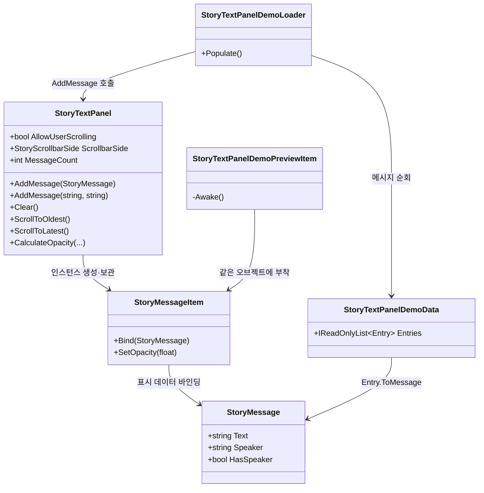
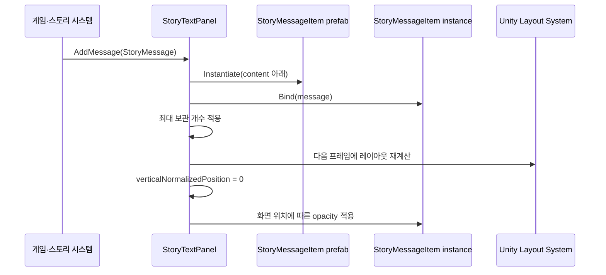
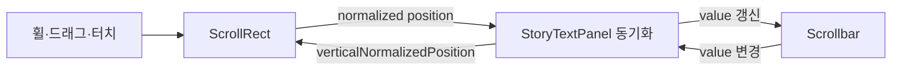

# StoryTextPanel 설계

## 목적

`StoryTextPanel`은 텍스트 RPG의 시간순 메시지 기록을 표시합니다. 최신 메시지는 아래쪽에 배치되고, 화면 위쪽의 오래된 메시지는 설정에 따라 점차 투명해집니다. 사용자 스크롤과 스크롤바 표현은 Inspector에서 선택할 수 있습니다.

이 컴포넌트는 스토리 규칙이나 현지화 키를 해석하지 않습니다. 호출자는 현지화가 완료된 문자열과 발화자를 `StoryMessage`로 전달해야 합니다.

## 런타임 클래스 관계



## 운영용 프리팹 계층

```text
StoryTextPanel
├── Viewport                 RectMask2D
│   └── Content              VerticalLayoutGroup, ContentSizeFitter
│       └── StoryMessageItem 런타임에 순서대로 생성됨
└── Scrollbar
    └── Sliding Area
        └── Handle
```

`StoryTextPanel` 루트에는 `Image`, `ScrollRect`, `StoryTextPanel` 컴포넌트가 있습니다.

`StoryMessageItem` 프리팹은 다음 구조를 사용합니다.

```text
StoryMessageItem             CanvasGroup, VerticalLayoutGroup, ContentSizeFitter
├── Speaker                  TextMeshProUGUI, 발화자가 없으면 비활성화됨
└── Body                     TextMeshProUGUI
```

## 메시지 추가 흐름



`followLatestMessage`가 활성화된 기본 상태에서는 메시지를 추가한 다음 프레임에 레이아웃을 갱신하고 최신 위치로 이동합니다. 이 한 프레임 지연은 `ContentSizeFitter`가 새 항목의 높이를 계산한 뒤 정확한 하단 위치를 얻기 위해 필요합니다.

## 스크롤 설계

Unity `ScrollRect`에 스크롤바를 직접 연결하면 콘텐츠 양에 따라 손잡이 크기가 자동으로 변합니다. 현재 요구 사항은 손잡이 길이를 일정하게 유지하는 것이므로 다음과 같이 분리합니다.



- `ScrollRect.verticalScrollbar`에는 값을 할당하지 않습니다.
- `Scrollbar.size`는 `scrollbarHandleSize`로 고정합니다.
- 스크롤바 값 `1`은 가장 오래된 메시지를 상단에 정렬합니다.
- 스크롤바 값 `0`은 가장 최신 메시지를 하단에 정렬합니다.
- 상호 갱신 중 재진입하지 않도록 `synchronizingScrollbar` 플래그를 사용합니다.

## 투명도 계산

각 `StoryMessageItem` 중심점을 Viewport 로컬 좌표로 변환하고, 아래쪽을 `0`, 위쪽을 `1`로 정규화합니다.

| 설정 | 의미 |
| --- | --- |
| `oldestVisibleOpacity` | Viewport 상단에 도달한 메시지의 최소 투명도입니다. |
| `fadeStartFromBottom` | 아래쪽에서 측정한 감쇠 시작 위치입니다. |
| `fadeExponent` | 감쇠 곡선의 형태를 조절합니다. 값이 크면 상단에 가까워질 때 더 빠르게 감쇠합니다. |

`fadeStartFromBottom` 아래의 메시지는 완전히 불투명합니다. 그 위에서는 정규화된 진행률에 지수 곡선을 적용하고 `1`에서 `oldestVisibleOpacity`까지 보간합니다.

현재 투명도는 물리적인 텍스트 줄 하나가 아니라 `StoryMessageItem` 전체에 적용됩니다. 하나의 항목에 긴 여러 줄 문단을 넣으면 문단 전체가 같은 투명도를 사용합니다. 실제 줄 단위 그라데이션이 필요해지면 Viewport용 UI 셰이더나 마스크를 별도의 변경으로 도입해야 합니다.

## Inspector 옵션

| 옵션 | 런타임 효과 |
| --- | --- |
| `Allow User Scrolling` | ScrollRect의 세로 입력과 스크롤바 표시를 활성화합니다. |
| `Scrollbar Side` | 스크롤바를 왼쪽 또는 오른쪽에 배치하고 Viewport 여백을 조정합니다. |
| `Show Scrollbar Background` | 스크롤바 트랙 이미지를 표시하거나 숨깁니다. |
| `Scrollbar Handle Size` | 콘텐츠 양과 무관한 고정 손잡이 길이를 설정합니다. |
| `Scrollbar Width`, `Scrollbar Gap` | 스크롤바 폭과 본문 사이 간격을 설정합니다. |
| `Follow Latest Message` | 메시지 추가 후 최신 위치로 이동합니다. |
| `Maximum Retained Messages` | 메모리에 유지하는 메시지 수를 제한합니다. `0`은 무제한입니다. |

## 데모와 Edit Mode 미리보기

`StoryTextPanelDemo.prefab`은 운영용 `StoryTextPanel.prefab`의 중첩 인스턴스를 포함합니다.

```text
StoryTextPanelDemo           StoryTextPanelDemoLoader
└── StoryTextPanel           운영용 중첩 프리팹
    └── Viewport/Content
        ├── Preview Item 01  StoryTextPanelDemoPreviewItem
        ├── ...
        └── Preview Item 16
```

Edit Mode 미리보기 항목은 데모 프리팹에 직렬화되어 있으므로 Prefab Mode 또는 Scene View에서 즉시 표시됩니다. `StoryTextPanelEditModePreview`가 열린 미리보기의 레이아웃과 투명도를 주기적으로 다시 계산합니다.

Play Mode에서는 각 `StoryTextPanelDemoPreviewItem`이 `Awake`에서 자신의 오브젝트를 비활성화하고 제거합니다. 이후 `StoryTextPanelDemoLoader.Start`가 `StoryTextPanelDemoData`의 내용을 실제 런타임 항목으로 추가합니다. 따라서 미리보기와 런타임 메시지가 기록에 중복되지 않습니다.

## 외부 시스템과의 연결 경계

향후 스토리 시스템은 다음 방향으로만 UI를 호출하는 것이 좋습니다.

```csharp
var message = new StoryMessage(localizedBody, localizedSpeaker);
storyTextPanel.AddMessage(message);
```

- `StoryTextPanel`이 현지화 서비스나 스토리 데이터베이스를 직접 참조하지 않게 유지합니다.
- 저장 데이터에는 생성된 `StoryMessageItem` 오브젝트가 아니라 스토리 진행 상태나 메시지 식별자를 보관합니다.
- 메시지 유형별 시각 표현이 필요하면 `StoryMessage`에 무분별하게 필드를 추가하기보다 표현 모델과 항목 팩토리 도입을 검토합니다.
- 대량 기록을 지원할 때는 `maximumRetainedMessages`, 오브젝트 풀링 또는 목록 가상화를 적용하고 실제 기기에서 측정합니다.
