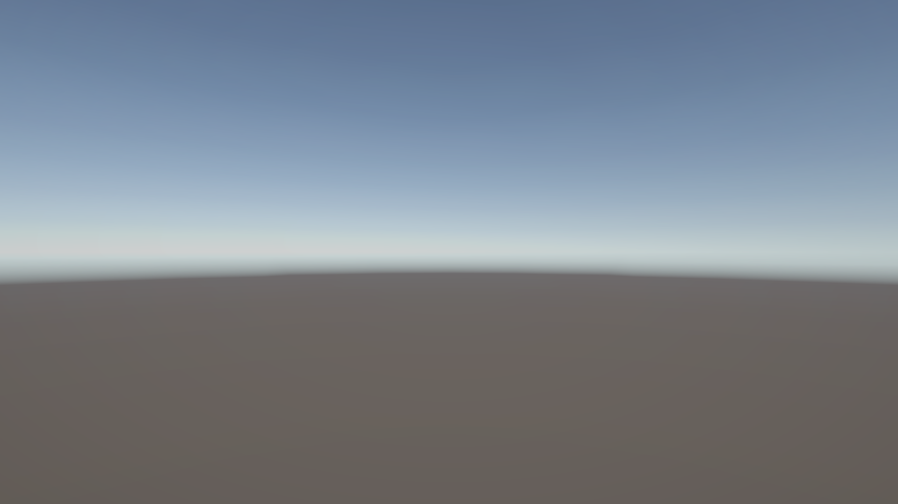

# 임시 적 전투

## 범위와 상태 소유권

`TMP_MainScene`의 임시 전투는 정식 전투·저장 시스템과 분리된 실행 검증 기능입니다. `TemporaryCombatState`는 Unity 객체를 참조하지 않는 순수 C# 상태이며, Scene 진입 시 운영 캐릭터의 현재·최대 체력 값을 새 `HealthState`에 복사합니다. 이후 피해와 회복은 복사본과 임시 적에게만 적용되므로 `PlayerSession`의 운영 체력과 저장 DTO는 변경되지 않습니다.

| 구성 요소 | 책임 |
| --- | --- |
| `TemporaryCombatConfiguration` | 활성 여부, 적 이름·외형 ID·체력 40·공격 5·회복 3을 설정합니다. |
| `TemporaryCombatState` | 양쪽 체력, 다음 적 행동, 종료 상태와 한 턴의 순차 적용 결과를 관리합니다. |
| `TemporaryDiceRollMenuController` | 기존 주사위를 한 번만 굴리고 전투 상태, 체력 바, 적 표현, 예고와 Story를 동기화합니다. |
| `TemporaryDiceMenuBuilder` | 설정 자산과 TMP_MainScene의 필수 참조를 선별 적용합니다. |

## 한 턴의 처리

`행동` 명령은 보유 주사위를 순서대로 한 번씩 굴립니다. 공격 면은 임시 적을 공격하고 회복 면은 임시 플레이어를 회복합니다. 적이 주사위 처리 도중 쓰러지면 이후 공격 면은 건너뛰지만 이후 회복 면은 계속 처리합니다. 적이 살아 있으면 예고된 공격 또는 회복을 한 번 수행하고 다음 행동으로 교대합니다. 최대 체력에서의 회복도 턴을 소비하며 실제 회복량 0을 기록합니다.

빠른 중복 실행은 컨트롤러의 실행 상태와 메뉴 실행 가능 상태로 차단합니다. 이미 완료된 전투는 추가 행동을 받지 않습니다. UI 기록 오류가 발생하더라도 이미 적용한 전투 결과를 자동으로 재실행하지 않습니다.

## Scene 수명과 표시

`MainScenePresentationController`가 기본 적 표시를 정리한 뒤 임시 컨트롤러가 세션을 준비하고 전투를 생성합니다. TMP_MainScene에서는 `EnemyDisplayPanelDemoLoader`의 초기 데이터 소유권을 해제하여 임시 전투 컨트롤러만 적 표시를 갱신합니다. Scene이 파괴되면 체력 변경 구독을 해제하며, 재진입하면 운영 상태의 새 복사본과 초기 적을 다시 생성합니다.

플레이어와 적 체력 바, 다음 적 행동, `StoryTextPanel`은 모두 같은 `TemporaryCombatState`를 읽습니다. 정식 전투, 보상, 경험치, 자동 부활, 3D 물리 굴림과 저장 반영은 이 기능의 범위에 포함되지 않습니다.

## 실행 화면

